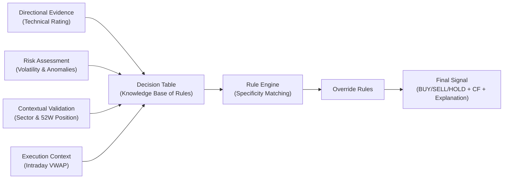

# Decision Layer — Signal Methodology

## Executive Summary

The **decision layer** is a structured, rule-based system that synthesizes multiple market signals into actionable **BUY / SELL / HOLD** recommendations, each annotated with a formal *certainty factor (CF)*. Unlike a black-box model, this layer uses an **explicit knowledge base** (a decision table of production rules) combined with clear inference logic (specificity ranking and overrides) to ensure transparency and explainability. The process is divided into four conceptual stages:

- **Directional Evidence (Technical Signals)** — Determines *whether there is a bullish or bearish tendency* based on daily chart indicators (SMAs, RSI, Bollinger Bands, etc.). This layer generates a raw **signal_score** and **rating** (Strong Buy/Buy/Neutral/Sell/Strong Sell) that propose an initial market direction.
- **Risk Assessment (Volatility & Anomalies)** — Evaluates *market stability and data integrity*. High volatility or anomalous price/volume events can **downgrade or block** signals, acting as safety gates that say “the conditions are too risky.”
- **Contextual Validation (Sector & 52W Position)** — Checks *market context and price extremes*. For example, a favorable sector or proximity to a 52-week low can **strengthen** a buy signal, while adversity can weaken it.
- **Execution Timing (Intraday VWAP)** — Adds *entry-level insight*. It indicates whether the current price is above or below the daily volume-weighted average price (VWAP). This influences *trade execution timing* (e.g. waiting for a dip below VWAP for a better entry) but does not by itself change the BUY/SELL outcome.

These inputs feed a unified decision process:



**In summary:** We do not rely on machine learning; instead we encode *domain expertise* as production rules. Each rule has a predefined **Certainty Factor (CF)** reflecting confidence. At runtime, the system identifies the most specific matching rule (tie-broken by ID), applies any post-hoc override (e.g. anomaly-driven SELL), and outputs the final signal.  Every recommendation is accompanied by explicit explanations (`why_signal`, `why_not_buy`, `reasoning_trace`), embodying the principles of explainable AI.

## Technical Signals (Directional Evidence)

This layer captures the **market direction and momentum** purely from price data. It is implemented by the `gold_technical_rating` model, which computes a **composite technical score** from eight common indicators. Each indicator casts a discrete vote: +1 for bullish (BUY), –1 for bearish (SELL), or 0 for neutral. These votes reflect both trend-following and mean-reversion conditions:

- **Price vs SMA10 (short-term trend):** If the closing price is above the 10-day Simple Moving Average (SMA10), we have upward momentum (**BUY** vote); if below, downward momentum (**SELL** vote). This captures very short-term trend.
- **Price vs SMA20 (mid-term trend):** Similar logic with the 20-day SMA, reflecting intermediate momentum.
- **Price vs SMA50 (medium-term trend):** The 50-day SMA reflects broader trend; above is bullish, below is bearish.
- **Price vs SMA200 (long-term trend):** The 200-day SMA signals the overall market regime; price above 200-SMA is bullish (BUY), below is bearish (SELL).
- **Short vs Long MA cross:** If SMA10 crosses above SMA20 (a *golden cross*), that’s strongly bullish (BUY); the reverse *death cross* is bearish (SELL).
- **RSI (14-day Relative Strength Index):** RSI < 30 indicates oversold (potential rebound → BUY); RSI > 70 indicates overbought (potential pullback → SELL).
- **Bollinger Bands (20-day, 2σ):** Closing below the lower band suggests mean-reversion upside (BUY); closing above the upper band suggests price is stretched (SELL).
- **MACD proxy (SMA12 vs SMA26):** If a 12-day SMA exceeds a 26-day SMA, that’s bullish (BUY); if not, bearish (SELL).

The individual votes are summed into a **signal_score** ranging from -8 (all indicators bearish) to +8 (all bullish). This score is then mapped to a categorical **rating**:

```text
signal_score = Σ votes   (range: –8 … +8)

 ≥ +5  →  Strong Buy  
 ≥ +3  →  Buy  
 ≤ –5  →  Strong Sell  
 ≤ –3  →  Sell  
 otherwise →  Neutral  
```

These outputs feed into the decision layer:
- `signal_score`: the net momentum score.
- `rating`: categorical group (Strong Buy/Buy/Neutral/Sell/Strong Sell) — used as a decision-table key.
- (Auxiliary columns like `buy_signals`, `sell_signals`, `rsi14`, `sma50`, etc. are passed along for explanations but not directly used in rule conditions.)

**Why this matters:** The technical signal is our **directional engine**. It embodies the consensus of multiple market indicators, avoiding reliance on any single metric. By summarizing them into one score and rating, it provides a clear *proposal*: bullish, bearish, or neutral. Downstream logic then decides whether this proposal should be executed. Without this layer, the system would have no directional bias at all.

## Risk Assessment (Volatility & Anomalies)

This layer evaluates **market stability and data anomalies** to avoid acting on spurious or excessively risky signals. It has two parts:

- **Volatility Index (`gold_volatility_index`)**: We compute a 20-day rolling volatility of log returns (annualized by √252) for each symbol-day. This yields `annualized_vol`, which we classify into:
  - > 80%  → **extreme**  (dangerously volatile)  
  - > 50%  → **high**     (elevated volatility)  
  - > 20%  → **normal**   (typical conditions)  
  - ≤ 20%  → **low**      (calm market)  

  These levels become the `vol_level` key for decision rules. High or extreme volatility indicates a risky environment, so the rules typically *hold* or reduce conviction under these conditions.

- **Anomaly Flags (`gold_anomaly_flags`)**: We detect unusual price or volume movements that may indicate abnormal events or data issues. Specifically, we flag:
  - **Volume spike:** 30-day Z-score of daily volume; flagged if |Z| > 2.5 (unusually large volume).
  - **Price outlier:** 90-day IQR filter on daily log returns; flagged if a return lies beyond [Q1 – 1.5 IQR, Q3 + 1.5 IQR].

  The outputs are boolean `has_price_anomaly` and `has_volume_anomaly`. A price anomaly (sudden spike/drop) typically triggers conservative action (often a HOLD or even a SELL override if other conditions are bearish).

**Why this matters:** Volatility and anomalies measure the *riskiness of the environment*. A technically strong stock can still fail disastrously in a storm. By gating on volatility (e.g. blocking buys when volatility is high) and catching data outliers, the system avoids acting on misleading signals. This layer acts as a **safety filter**: it does not generate a bias toward BUY or SELL on its own, but it can *veto or weaken* aggressive signals when conditions are unstable, ensuring we only trade in trusted market conditions.

## Contextual Validation (Sector & 52-Week Levels)

Even a great stock can struggle in a bad sector or when hitting a price ceiling. This layer provides *market context* to temper or reinforce signals:

- **Sector Performance (`gold_sector_performance`)**: We measure the broad market context by sector. Compute `advance_ratio` = (number of stocks up today)/(total stocks in sector). If ≥ 50%, set `sector_ok = TRUE` (sector is broadly advancing); otherwise `sector_ok = FALSE`. A strong sector (sector_ok=TRUE) is a bullish tailwind for most stocks, whereas a weak sector is a headwind.

- **52-Week Position (`gold_52w_levels`)**: We track the rolling one-year high (`high_52w`) and low (`low_52w`) for each stock. If the current close is within 2% of these extremes, we flag:
  - `at_52w_high = TRUE` if close is near the 52W high (risk of resistance).
  - `at_52w_low = TRUE` if close is near the 52W low (potential support).
  
  We then define `at_52w_pos`: *near_low* if near low, *near_high* if near high, or *neutral* otherwise. Stocks near 52W lows are often mean-reversion candidates; near highs may indicate exhaustion or breakout risk.

**Why this matters:** Sector and price-position features answer *“Is the environment helping this trade?”* A technical buy signal is more convincing if the broader sector is rising or if the stock is near a historic low. Conversely, a weak sector or stock near its high warrants caution. This layer ensures our signals align with prevailing market conditions, effectively *validating* or adjusting our trade ideas.

## Execution Timing (Intraday VWAP)

VWAP (Volume-Weighted Average Price) is computed from intraday tick data (`gold_intraday_vwap`). It tells us *“Is the current price above or below today’s average traded price?”*. For example, if today’s price is above VWAP, a trader might wait to buy closer to VWAP for a better entry.

- We calculate VWAP = Σ(price_t × volume_t) / Σ(volume_t) over each trading session.
- The `session_vwap` is available only during market hours (via the live tick feed) and is `NULL` otherwise.

**Why this matters:** VWAP provides *execution context* but does not by itself change the main BUY/SELL decision. It answers *“when to enter?”* rather than *“what to do?”*. In our system, `session_vwap` is included in the output for informational purposes (not a decision-table key). For instance, if we decide to BUY tomorrow, knowing today’s price vs VWAP can guide us to *delay or scale-in* until the price moves toward VWAP. In summary, VWAP helps optimize trade timing without altering the fundamental signal outcome.

## Decision Table (Knowledge Base of Production Rules)

The core of our decision logic is a hand-crafted **decision table** of production rules (`dbt/seeds/decision_table.csv`). Each row is a named IF-THEN rule:

```
IF rating_group = X
  AND has_anomaly  = Y
  AND sector_ok    = Z
  AND vol_level    = V
  AND at_52w_pos   = P
THEN signal = S, signal_cf = CF
```

Here `rating_group` ∈ {Strong Buy, Buy, Neutral, Sell, Strong Sell}. The other fields take values `TRUE`/`FALSE` or enumerated categories (`any` means “don’t care”; `vol_level` is in {low, normal, high, extreme}; `at_52w_pos` in {near_low, neutral, near_high}). The **`signal_cf`** column (–1.0 to +1.0) is our formal confidence factor for that rule.

The table has 36 rows (plus one global fallback). We structure them symmetrically by rating group, each covering gate/differentiator scenarios. For each of the five rating groups, there are seven rules:

- **Volatility Gates:** Blocks or modifies signals under high risk (S01, S02 in StrongBuy; S08, S09 in Buy; etc).
- **Anomaly Gates:** Blocks signals if price anomaly is detected (S03, S10, S17, S24, S31).
- **Sector Headwind:** Holds if the sector is weak (S04, S11, S18, S25, S32).
- **Near-52W Low:** Boosts buy conviction (S05, S12, S19, S26, S33).
- **Near-52W High:** Cautions on breakouts (S06, S13, S20, S27, S34).
- **Default:** The base case for that rating (S07, S14, S21, S28, S35).

Finally, **S36** is a catch-all fallback (all conditions `any`), which yields HOLD with CF=0.00.

For example, the **Strong Buy** group (rating=Strong Buy) is:

- S01: has_anomaly=false, sector_ok=true, vol_level=high, at_52w_pos=any ⇒ **HOLD**, CF=+0.22 (LOW confidence) — high volatility blocks the buy.
- S02: has_anomaly=false, sector_ok=true, vol_level=extreme, at_52w_pos=any ⇒ **HOLD**, CF=-0.12 (LOW) — extreme volatility.
- S03: has_anomaly=true, sector_ok=any, ... ⇒ **HOLD**, CF=-0.20 (LOW) — anomaly blocks.
- S04: sector_ok=false, vol_level=any, at_52w_pos=any ⇒ **HOLD**, CF=+0.12 (LOW) — sector drag.
- S05: no anomalies, sector_ok=true, at_52w_pos=near_low ⇒ **BUY**, CF=+0.92 (HIGH) — ideal setup.
- S06: no anomalies, sector_ok=true, at_52w_pos=near_high ⇒ **BUY**, CF=+0.72 (HIGH) — slightly cautious buy.
- S07: default (all any except rating, sector_ok=true) ⇒ **BUY**, CF=+0.88 (HIGH).

The other groups (Buy, Neutral, Sell, StrongSell) have analogous rules (see full table). The confidence values (`signal_cf`) are chosen by domain expertise. They act like Certainty Factors: +1.0 is maximum BUY conviction, –1.0 maximum SELL. For instance, S05’s CF=+0.92 means an extremely strong buy signal. This allows us to capture gradations (e.g. +0.55 is only medium conviction) and to compare signals across contexts.

We deliberately use a decision table rather than machine learning to prioritize **explainability and expert control**. Each rule is fully human-readable and editable (no SQL or code needed to tweak rules). The knowledge base (CSV) embodies trading heuristics explicitly (e.g. “near 52W low is very bullish”). Because it doesn’t rely on historical fitting, the logic is transparent and instantly updatable by domain experts.

### Decision Rule Summary (Signal Confidence)

The rules can be summarized by key scenarios and their confidence levels:

| Rating Group   | Scenario / Condition           | Output  | Example CF (state) | Conviction |
| -------------- | ----------------------------- | ------- | ------------------ | ---------- |
| **Strong Buy** | No blocks (clean conditions)  | BUY     | +0.88 (S07)        | High       |
|                | Near 52W low                  | BUY     | +0.92 (S05)        | High       |
|                | Near 52W high                 | BUY     | +0.72 (S06)        | High       |
|                | High volatility (gate)        | HOLD    | +0.22 (S01)        | Low        |
|                | Price anomaly                 | HOLD    | -0.20 (S03)        | Low        |
| **Buy**        | No blocks                     | BUY     | +0.70 (S14)        | High       |
|                | Near 52W low                  | BUY     | +0.80 (S12)        | High       |
|                | Near 52W high                 | BUY     | +0.55 (S13)        | Medium     |
|                | Sector weak                   | HOLD    | 0.00 (S11)         | Low        |
|                | Price anomaly                 | HOLD    | -0.28 (S10)        | Low        |
| **Neutral**    | Default                       | HOLD    | 0.00 (S21)         | Low        |
|                | Near 52W low                  | HOLD    | +0.12 (S19)        | Low        |
| **Sell**       | No blocks                     | SELL    | -0.70 (S28)        | High       |
|                | Sector weak                   | SELL    | -0.75 (S25)        | High       |
|                | Price anomaly                 | SELL    | -0.85 (S24)        | High       |
|                | Near 52W high                 | SELL    | -0.82 (S27)        | High       |
|                | Near 52W low                  | SELL    | -0.52 (S26)        | Medium     |
| **Strong Sell**| Any (generally maximal sell)  | SELL    | -0.90 (S35)        | High       |
|                | (e.g. anomaly or headwind)    | SELL    | -0.95 (S31)        | High       |
| **Fallback**   | (catch-all)                   | HOLD    | 0.00 (S36)         | Low        |

## Rule Matching and Specificity

At runtime, each stock’s features (rating, vol_level, etc.) are compared against all 36 rules. Many rules may match simultaneously (for example, one rule for “vol_level=high” and another for “at_52w_pos=near_low” might both apply). We resolve conflicts by computing a **specificity score** for each matching rule:

```
specificity_score = count(condition ≠ 'any')
                  = (rating_group != any) + (has_anomaly != any)
                  + (sector_ok != any) + (vol_level != any) + (at_52w_pos != any)
```

The rule with the highest specificity (most non-any fields) wins. If there’s a tie, the lower `state_id` (row number) wins. This deterministic tie-break allows us to impose our intended priorities (for example, we deliberately gave volatility gates lower state_ids so they outrank default buys when both apply).

**Example resolutions:**  
1. **Strong Buy, high volatility, near low:** Inputs match both S01 (vol_level=high) and S05 (at_52w_pos=near_low), each with specificity 4. Rule S01 has the smaller ID, so it wins → *HOLD* (CF=+0.22). High volatility thus blocks the buy near low.  
2. **Strong Buy, normal volatility, near low:** S01 no longer matches, so S05 (near_low) wins (specificity 4) → *BUY* (CF=+0.92).  
3. **Strong Buy, price anomaly:** S03 (has_anomaly=true) matches (specificity 2) and rules out the buy → *HOLD* (CF=-0.20).  

```mermaid
flowchart TD
    Inputs[Classified Inputs (rating, vol_level, ...)] --> TableMatch[Match all rules]
    TableMatch --> Filter[Select by highest specificity]
    Filter --> Pick[Pick lowest state_id if tied]
    Pick --> Signal[Signal + CF from chosen rule]
```

This rule engine logic ensures that the most specific scenario dictates the outcome, implementing our domain knowledge explicitly.

## Anomaly-Driven Sell Override

After table lookup, we apply one final override rule to handle a corner case not covered above. If a stock is Neutral or weakly bearish (**signal_score ≤ 0**) *and* has a price anomaly, we force a medium-strength SELL. Formally:

```
IF has_price_anomaly = TRUE
  AND signal_score < 0
THEN signal = SELL, signal_cf = -0.50
```

This catches cases where the table would otherwise give a weak HOLD (e.g. “Neutral + anomaly”), but logically we prefer an actual sell signal. It ensures that a sudden bad spike in price leads to a prompt SELL with moderate conviction.

## Certainty Factor Interpretation

The `signal_cf` output is a numeric confidence measure in [-1.0, +1.0]: +1.0 means maximum BUY conviction, -1.0 means maximum SELL conviction, and values near 0 imply weak conviction (a Hold tendency). We categorize it into qualitative tiers for users:

| Category    | CF Range       | Confidence Tier | Description              |
| ----------- | -------------- | --------------- | ------------------------ |
| **High BUY**    | +0.65 … +1.0   | **HIGH**        | Very strong buy signal   |
| **Med BUY**     | +0.40 … +0.64  | **MEDIUM**      | Moderate buy conviction  |
| **Low/None**    | -0.39 … +0.39  | **LOW**         | Weak/no strong signal    |
| **Med SELL**    | -0.64 … -0.40  | **MEDIUM**      | Moderate sell conviction |
| **High SELL**   | -1.0 … -0.65   | **HIGH**        | Very strong sell signal  |

This scale is inspired by classic expert-system practice (e.g. the MYCIN system). In our output, we display both the numeric `signal_cf` and the `confidence` tier. For example, S05’s CF=+0.92 is labeled HIGH conviction, whereas a CF=+0.22 is LOW.

## Explanation Facility (Why and How)

A key benefit of this design is its built-in explainability. For each output row, we provide:

- **`why_signal`** – A concise text explaining the decision. It includes the signal and CF, the matched rule ID, and a brief reason (e.g. *“state=S05: strong technicals + clean conditions + near 52W low”*).  
- **`why_not_buy`** – If the final signal is HOLD or SELL, this lists the *first* reason BUY was blocked (e.g. “High volatility (80% ann.) – too risky”). It is NULL when the signal is BUY.  
- **`why_not_sell`** – If the final signal is BUY or HOLD, this lists why a SELL wasn’t triggered (e.g. “Rating is only Buy, not Sell”). It is NULL when the signal is SELL.  
- **`reasoning_trace`** – A numbered step-by-step log of the inference: it notes how inputs were classified, which rule fired, and what the output was.

These fields embody Explainable AI (XAI) principles. For example, an output might include:

> why_signal: “**BUY (CF=0.92, HIGH)** — state=S05: strong technicals + clean conditions + near 52W low”  
> why_not_buy: *NULL* (since we bought)  
> reasoning_trace: “1. Inputs -> rating=Strong Buy (score=7), anomaly=FALSE, sector_ok=TRUE, vol_level=normal, at_52w_pos=near_low.  
> 2. Matched rule state=S05.  
> 3. Signal=BUY, CF=+0.92 (HIGH).”

If a hold occurs due to volatility, `why_not_buy` might read: *“High volatility (62.4% annualized) – position risk”*, and `why_signal` might note state=S01 (“volatility blocks BUY”). The `reasoning_trace` always clarifies each step. This makes the decision process transparent to human reviewers.

## End-to-End Examples

Here are three scenarios illustrating the full flow (inputs → rule → output):

1. **Strong Buy scenario (ideal conditions):**  
   - *Inputs:* symbol XYZ, rating=Strong Buy (score=+7), vol_level=normal, sector_ok=TRUE, has_price_anomaly=FALSE, at_52w_pos=near_low.  
   - *Decision Table Match:* Only rule **S05** (Strong Buy, no anomaly, sector OK, near_low) applies with highest specificity.  
   - *Output:* **BUY**, CF=+0.92 (HIGH).  
   - *Explanation:* `why_signal` = “BUY (CF=0.92, HIGH) — state=S05: strong technicals + clean conditions + near 52W low”; `why_not_buy` = NULL; `reasoning_trace`: 
     1. Inputs classified as above.  
     2. Matched rule S05.  
     3. Signal=BUY, CF=+0.92 (HIGH).

2. **Strong Buy blocked by volatility:**  
   - *Inputs:* rating=Strong Buy (score=+6), vol_level=high, sector_ok=TRUE, anomaly=FALSE, at_52w_pos=near_low.  
   - *Decision Table Match:* Both S01 (vol=high) and S05 (near_low) match (specificity 4). **S01** wins (lower ID).  
   - *Output:* **HOLD**, CF=+0.22 (LOW).  
   - *Explanation:* `why_signal` = “HOLD (CF=0.22, LOW) — state=S01: high volatility blocks BUY”; `why_not_buy` = “High volatility (80% ann.) – position risk”; `reasoning_trace`: 
     1. Inputs -> rating=Strong Buy, anomaly=FALSE, sector_ok=TRUE, vol_level=high, at_52w_pos=near_low.  
     2. Matched S01 (high volatility gate).  
     3. Signal=HOLD, CF=+0.22 (LOW).

3. **Neutral rating with price anomaly (override):**  
   - *Inputs:* rating=Neutral (score=0), vol_level=normal, sector_ok=TRUE, has_price_anomaly=TRUE.  
   - *Decision Table Match:* Normally rule S17 (Neutral + anomaly) would apply (HOLD).  
   - *Override:* Since score≤0 and price anomaly=true, the anomaly rule triggers a SELL.  
   - *Output:* **SELL**, CF=-0.50 (MEDIUM).  
   - *Explanation:* `why_signal` = “SELL (CF=-0.50, MEDIUM) — anomaly+negative trend override”; `why_not_buy` = “Neutral rating (score=0) – not eligible for BUY”; `reasoning_trace`:
     1. Inputs -> rating=Neutral, anomaly=TRUE, vol_level=normal, sector_ok=TRUE.  
     2. Decision table would match state S17, but we check override.  
     3. Override rule fires: final Signal=SELL, CF=-0.50.

(*A Sell example:* For completeness, a strong Sell rating (score≤–5) with no anomalies would match S29–S35 and produce a SELL with CF ~ -0.90 or lower.)

## Design Rationale

**Why a Decision Table instead of Machine Learning?** We prioritize *transparency and expert control*. A decision table is a human-readable knowledge base: experts can inspect and update it (via CSV) without coding or retraining. It requires no historical training data or opaque fitting process; each rule explicitly codifies domain logic (e.g. “strong technicals + near support = buy”). This makes the system fully auditable and adaptable by domain specialists.

**Why Certainty Factors?** Traders think in degrees of conviction, not just yes/no. Certainty Factors let us encode *how strongly* a rule should fire. They provide a continuous score from –1.0 to +1.0, which we then map into HIGH/MEDIUM/LOW confidence. This follows classic expert-system practice (e.g. MYCIN) and produces intuitive outputs (e.g. +0.80 is more convincing than +0.40).

**Why Specificity-based resolution?** When multiple rules match, we need a clear priority. We compute each rule’s *specificity* by counting how many conditions it fixes (not “any”). The more specific rule wins. For ties, we break by lower state_id. This deterministic strategy encodes our design priorities (for example, volatility gates outrank defaults). It avoids arbitrary rule ordering and ensures the most contextually relevant rule is chosen.

**Explainability:** By design, every decision is traceable. The output includes the matched rule (`state_id`), the CF, and human-readable `why_signal`/`why_not_*` messages. A user can follow the inference step by step. This aligns with Explainable AI (XAI) principles, ensuring stakeholders (traders, analysts, auditors) can understand *why* each signal was generated without needing to reverse-engineer a black box.

