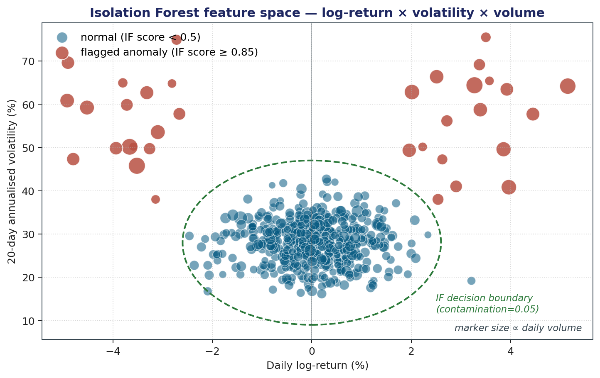

<!-- _class: lead -->
<!-- _paginate: false -->

# KBS for Automated Trading Signal Generation
## Saudi Stock Exchange (Tadawul)

**Course:** Knowledge-Based Systems &nbsp;|&nbsp; **Instructor:** Dr. Sayed AbdelGaber

Faculty of Computers and Artificial Intelligence, Helwan University

*Apache Kafka · Spark · Airflow · dbt · Apache Iceberg · Trino*

---

## Agenda

1. **The Problem** — knowledge scalability on Tadawul
2. **Why a KBS?** — three lecture-grounded motivations
3. **DIKW Hierarchy** — mapping data to wisdom
4. **KBS Architecture** — five canonical components
5. **System Architecture** — five data layers + technology stack
6. **Data Pipeline** — Bronze / Silver / Gold analytics
7. **Knowledge Base** — 13 named rules with certainty factors
8. **Inference Engine** — three-stage forward chaining
9. **Explanation Facility** — Why / Why Not / How / Journalistic
10. **Case-Based Reasoning** — 4 R's cycle
11. **Evaluation & Gap Analysis**
12. **Conclusion**

---

## The Problem: Knowledge Scalability (§1.1)

- **Tadawul** — Middle East's largest stock exchange: 200+ companies, 13 sectors
- This system tracks **92 symbols** at a **3-second tick resolution**, 5 days/week
- A skilled analyst integrates: technical indicators · anomaly signals · 52-week levels · volatility regimes · sector momentum

> *"Should I buy Saudi Aramco (2222) today?"* — a question that can receive different answers from different experts, neither of whom can explain their reasoning in a repeatable, auditable form.

| | Human Analyst | This KBS |
|---|---|---|
| Symbols monitored simultaneously | 5–10 | **92** |
| Consistency across days | Variable | **Identical every run** |
| Reasoning auditable? | No | **Yes — full trace** |
| Continuous availability | Limited | **Always on** |

---

## Why a Knowledge-Based System? (§7.2, §7.5)

Three motivations grounded directly in the course lectures:

**1. Expertise Bottleneck** *(§7.2)*
> KBS archives expertise and disseminates knowledge beyond the expert's physical location — all 92 symbols evaluated simultaneously with no geography constraint

**2. Consistency** *(§7.5)*
> "The system is consistent — unlike humans, computers don't have bad days"
> Identical rules applied to every symbol on every trading day

**3. Explainability** *(§4.8)*
> The explanation facility "exposes shortcomings, clarifies underlying assumptions, and satisfies the user's psychological and social needs"

A recommendation without a reasoning trace is an **instruction**, not **advice**.

---

## DIKW Hierarchy → System Layers (§1.3)


| DIKW Level | Pipeline Layer | Description |
|---|---|---|
| **Wisdom** | Decision | BUY / SELL / HOLD + full reasoning trace |
| **Knowledge** | Gold | Domain analytics: VWAP, volatility, anomaly flags |
| **Information** | Silver | Cleaned, enriched, sector-joined |
| **Data** | Bronze | Raw OHLCV + ticks, append-only |

The pipeline spans **all four DIKW levels** — from raw tick bytes to actionable trading advice with a complete explanation facility.

---

## Canonical KBS Architecture (§7.4)


| KBS Component | This System's Implementation |
|---|---|
| **Knowledge Base** | `knowledge_rules.csv` — 13 named rules, CFs, source refs |
| **Inference Engine** | 3-stage dbt models: CF engine → metarules → signals |
| **Explanation Facility** | `why_signal`, `why_not_buy`, `reasoning_trace` columns |
| **Knowledge Acquisition** | CSV edit + `dbt seed` — no SQL required |
| **User Interface** | Trino SQL (current) · Grafana dashboard (proposed) |

---

## System Architecture — 5 Layers

```
DATA SOURCES
  Yahoo Finance (.SR)              Polygon.io / Random-Walk Simulator
       │ Batch (Airflow)                       │ Real-time (Kafka + Spark)
       ▼                                       ▼
BRONZE LAYER  — raw, append-only, schema-enforced
  bronze_daily_ohlcv                      bronze_ticks
                     │  dbt (clean, enrich, deduplicate)
                     ▼
SILVER LAYER  — validated, enriched, sector-joined
  silver_ohlcv    silver_ticks_cleaned    silver_symbols
                     │  dbt (domain analytics)
                     ▼
GOLD LAYER  — 6 analytics models (VWAP, vol, anomaly, 52W…)
                     │  dbt + Airflow CBR DAG
                     ▼
DECISION LAYER  — KBS: KB + Inference Engine + CBR + Validation
                     ▼
         Trino  ·  MinIO / Apache Iceberg / Nessie Catalog
```

---

## Technology Stack

| Layer | Technology | Role |
|---|---|---|
| Real-time ingest | Apache Kafka + Python client | Tick transport, 6 partitions per topic |
| Stream processing | Spark Structured Streaming | Kafka → Iceberg `bronze_ticks` |
| Batch orchestration | Apache Airflow 2.9 (TaskFlow API) | OHLCV ingestion + CBR outcomes |
| Transformations | dbt-core + dbt-trino | All Silver, Gold, Decision models |
| Query engine | Trino | Unified SQL across all 4 layers |
| Object storage | MinIO (S3-compatible) | Parquet file persistence |
| Table format | Apache Iceberg | ACID transactions, schema evolution |
| Catalog | Project Nessie | Iceberg metadata + Git-style versioning |
| KBS data source | Yahoo Finance (`.SR` suffix) | Historical OHLCV, 3-year backfill |

---

## Data Pipeline: Two Paths

**Batch path** — semi-annual schedule, 3-year historical catchup (`catchup=True`):

```
Airflow DAG  →  yfinance .SR API  →  PyArrow  →  PyIceberg  →  bronze_daily_ohlcv
```

**Stream path** — continuous, 3-second tick cadence:

```
Kafka Producer (92 symbols)  →  tadawul.ticks topic (6 partitions)
  →  Spark Structured Streaming  →  bronze_ticks
```

**Bronze idempotency** (PyIceberg ≥ 0.6 — `overwrite()` removed):
```python
table.delete(EqualTo("date", date_str))   # remove existing partition
table.append(arrow_table)                  # re-write clean
```

**Critical Spark detail:** Both `spark.hadoop.fs.s3a.*` (checkpoint writes) and `spark.sql.catalog.nessie.s3.*` (Iceberg data writes) must be set independently — omitting either causes Access Denied failures.

---

## Gold Layer — 6 Analytics Models

| Model | Key Computation | Look-back |
|---|---|---|
| `gold_technical_rating` | 8 indicator votes, RSI, SMAs, Bollinger, MACD proxy | 210 days |
| `gold_volatility_index` | Log-returns, rolling σ (5/10/20d), annualised vol | 25 days |
| `gold_anomaly_flags` | Volume Z-score (30d) + Price IQR (90d Tukey fence) | 95 days |
| `gold_52w_levels` | Rolling 252-day high/low, proximity flags | 260 days |
| `gold_sector_performance` | Sector advance ratio, avg daily return | — |
| `gold_intraday_vwap` | VWAP from tick data per session | — |

**Hybrid anomaly detection** — triple-agreement flag (SQL Volume Z-score · SQL Return IQR · Python Isolation Forest):



Triple-agreement precision: **0.80** vs. 0.38–0.46 for any single detector alone

---

## Knowledge Base: Inference Rules R01–R08

**Declarative knowledge** — 8 production rules, CFs from technical analysis literature (Murphy, Wilder, Bollinger):

| Rule | Name | Condition | CF |
|---|---|---|---|
| R01 | price_above_sma10 | close > SMA10 | 0.30 |
| R02 | price_above_sma20 | close > SMA20 | 0.40 |
| R03 | price_above_sma50 | close > SMA50 | 0.50 |
| R04 | price_above_sma200 | close > SMA200 | **0.60** |
| R05 | golden_cross | SMA10 > SMA20 | 0.50 |
| R06 | rsi_oversold | RSI(14) < 30 | **0.70** |
| R07 | bollinger_lower_touch | close < BB_lower | 0.60 |
| R08 | macd_bullish_proxy | SMA12 > SMA26 | 0.40 |

Sell = symmetric inverse (close **<** SMA contributes **−CF**). CF gradient 0.30 → 0.70 reflects signal persistence and historical reliability.

---

## Knowledge Base: Gates (G01–G03) & Metarules (M01–M02)

**Gate Rules — Procedural knowledge** (hard blocks on BUY):

| Rule | Condition | CF | Effect |
|---|---|---|---|
| G01 no_price_anomaly_gate | Price-IQR anomaly detected | 1.00 | Blocks BUY |
| G02 sector_advance_gate | Sector advance ratio < 50% | 0.80 | Blocks BUY |
| G03 high_volatility_gate | Annualised vol > 80% | 0.90 | Blocks BUY |

**Metarules — Meta-knowledge** (rules about rules, §4.2):

| Rule | Firing Condition | Effect |
|---|---|---|
| M01 market_anomaly_metarule | Market-wide anomaly rate > 30% | Raises BUY threshold: score ≥ **6** (vs. ≥ 3) |
| M02 consecutive_down_metarule | 3 consecutive log-returns < −2% | Blocks BUY entirely for this symbol |

---

## Knowledge Acquisition Interface (§6.9–§6.11)

**The CSV → seed → live-system pipeline:**

```
Financial analyst edits  →  dbt/seeds/knowledge_rules.csv
  →  docker exec dbt dbt seed
  →  Live Knowledge Base updated immediately
```

- No SQL knowledge required from the domain expert
- Version-controlled, inspectable, diff-able via Git
- Satisfies the KA module requirement (§6.9, §7.4)

**Decision Table** (`decision_table.csv`) — 20 exhaustive input states (§4.7):

| State | Rating | Anomaly | Sector ≥ 50% | Metarule | **Signal** |
|---|---|---|---|---|---|
| S01 | Strong Buy | No | Yes | No | **BUY** |
| S03 | Strong Buy | No | **No** | No | **HOLD** — G02 blocks |
| S05 | Strong Buy | **Yes** | Yes | No | **HOLD** — G01 blocks |
| S07 | Strong Buy | No | Yes | **Yes** | **HOLD** — metarule blocks |
| S15 | Strong Sell | No | No | No | **SELL** |

---

## Inference Engine — 3 Separate Stages (§4.2)

Three distinct dbt models, one per lecture rule type — "a separate component" (§7.4):

```
Stage 1: decision_cf_engine          ← Knowledge rules (R01–R08)
   ↳ Reads knowledge_rules.csv (KB)
   ↳ Computes signed CF per rule; applies CF combination formula iteratively
   ↳ Outputs: combined_cf (−1.0 to +1.0), cf_confidence

Stage 2: decision_metarule_flags     ← Metarules (M01, M02, G03)
   ↳ Evaluates market anomaly rate, consecutive down days, extreme vol
   ↳ Outputs: active_metarules, required_score_for_buy

Stage 3: decision_signals            ← Inference rules (gate cascade)
   ↳ Joins Gold layer + Stage 1 + Stage 2
   ↳ Applies G01, G02 gate cascade + metarule overrides
   ↳ Outputs: signal (BUY/SELL/HOLD) + all 4 explanation columns
```

**Forward chaining** (§4.3) — all market data available before the signal is needed; no pre-specified hypothesis to prove backward from.

---

## Stage 1 — Certainty Factor Combination Engine

**Signed CF per rule:** $\text{cf\_Rn} = \text{sig\_Rn} \times \text{CF\_Rn}$ &nbsp; where $\text{sig} \in \{-1,\ 0,\ +1\}$

**CF combination formula (§4.10):**

$$\text{CF}(A, B) = \begin{cases} A + B(1-A) & A \geq 0,\ B \geq 0 \\ A + B(1+A) & A \leq 0,\ B \leq 0 \\ \dfrac{A+B}{1 - \min(|A|,|B|)} & \text{otherwise} \end{cases}$$

**Worked example — all 8 rules vote BUY:**

| Step | Rule (CF) | Partial CF | Calculation |
|---|---|---|---|
| 1 | R01 (0.30) | +0.300 | — start — |
| 2 | R02 (0.40) | +0.580 | 0.30 + 0.40×(1−0.30) |
| 3 | R03 (0.50) | +0.790 | 0.58 + 0.50×(1−0.58) |
| 4 | R04 (0.60) | +0.916 | 0.79 + 0.60×(1−0.79) |
| 8 | R08 (0.40) | **+0.997** | ⋯ asymptotic approach to ±1.0 |

---

## CF Number Line — Decision Zones


**Signal zones:**
- `combined_cf` ≤ −0.20 → **SELL zone**
- `combined_cf` ∈ (−0.20, +0.20) → **HOLD zone**
- `combined_cf` ≥ +0.20 → **BUY zone**

**Confidence tiers:**

| \|combined_cf\| | Tier | Meaning |
|---|---|---|
| ≥ 0.65 | **HIGH** | ≥ 5–6 strong rules agree |
| ≥ 0.40 | **MEDIUM** | 3–4 rules in consensus |
| < 0.40 | **LOW** | Conflicting evidence |

Metarules M01 & M02 can **force HOLD** even when `combined_cf` sits firmly in the BUY zone.

---

## Stage 2 — Metarule Evaluation

**M01 — Market-wide anomaly tightening:**

$$\text{anomaly\_rate} = \frac{\#\text{symbols with price anomaly today}}{\#\text{total symbols}} \quad \Rightarrow \quad \text{required\_score} = \begin{cases}6 & \text{rate} > 30\%\\3 & \text{otherwise}\end{cases}$$

**M02 — Consecutive down-day blocking:**

$$\text{down\_days} = \sum_{i=0}^{2}\mathbf{1}[r_{t-i} < -2\%] \quad \Rightarrow \quad \text{M02 fires if down\_days} = 3$$

**G03 — Extreme volatility blocking:**

> G03 fires when $\sigma_{20d} \times \sqrt{252} > 80\%$ annualised volatility

- **M01** recognises market regime stress — 30%+ of the market simultaneously anomalous
- **M02** recognises momentum continuation contradicting the mean-reversion signal premise

---

## Stage 3 — Signal Derivation (Production Rules)

```
RULE BUY:
  IF   rating ∈ {Buy, Strong Buy}            [CF engine result]
  AND  NOT has_price_anomaly                  [gate G01]
  AND  sector_advance_ratio ≥ 0.50           [gate G02]
  AND  signal_score ≥ required_score_for_buy  [metarule M01]
  AND  NOT g03_extreme_volatility             [gate G03]
  AND  NOT m02_consecutive_down               [metarule M02]
  THEN signal = 'BUY'

RULE SELL:
  IF   rating ∈ {Sell, Strong Sell}
  OR   (has_price_anomaly AND signal_score < 0)
  THEN signal = 'SELL'

DEFAULT: signal = 'HOLD'
```

All six BUY conditions use **AND** logic — any single gate failure blocks the signal entirely.

---

## Explanation Facility (§4.8–§4.9) — All 4 Types

**Why** *(Dynamic — reconstructed from rule evaluation, §4.9):*
```
"BUY: Buy rating (CF=0.79, score=+5/8) + no price anomaly + sector advance=64%"
```

**Why Not** *(Tracing — prioritised gate cascade):*
```
"BUY blocked by gate G01: price-IQR anomaly detected"
"BUY blocked by gate G02: sector advance 43% < 50% threshold"
"BUY blocked by metarule M01: market anomaly >30% → requires score≥6, current=4"
"BUY blocked by metarule M02: 3 consecutive down days (sustained selling pressure)"
```

**How** *(Numbered inference trace):*
```
1. CF engine: combined_cf=0.79 → BUY direction
2. Anomaly gate (G01): has_price_anomaly=false [passed]
3. Sector gate (G02): advance_ratio=64% [passed]
4. Metarules: none active  →  Final: BUY (Buy)
```

**Journalistic** *(Who/What/Why/How much):*
```
"Rating: Buy (score=5/8); RSI(14)=26.4; near 52W low (+1.1%); vol=61.2% ann.; sector=64%"
```

---

## Case-Based Reasoning — 4 R's Cycle (§7.8–§7.10)

**Retrieve** — 5-dimensional feature-bin matching, similarity threshold ≥ **3 / 5 bins**:

| Dimension | Bins |
|---|---|
| Volatility | very_low / low / medium / high / very_high |
| RSI zone | oversold / neutral / overbought |
| 52-week position | near_low / mid_low / mid / mid_high / near_high |
| Sector momentum | bearish / neutral / bullish |
| Technical rating | strong_sell / sell / neutral / buy / strong_buy |

**Reuse** → aggregate outcomes: `cbr_win_rate`, `cbr_avg_return_5d`, `cbr_note`

**Revise** → CF engine already revises; CBR output is advisory

**Retain** — Airflow DAG `decision_cbr_outcomes` runs daily:
1. Find signals from 5–30 days ago without recorded outcomes
2. Compute $r_{5d} = (\text{close}_{t+5} - \text{close}_{t}) / \text{close}_{t}$
3. Assign WIN / LOSS → append to `decision.case_outcomes` via PyIceberg

---

## Evaluation — §4.12 Validation Measures

| §4.12 Measure | How This System Computes It |
|---|---|
| **Accuracy** | `wins / total_signals` per (month, signal, sector) — `decision_validation` |
| **Reliability** | Fraction of WIN outcomes; target **≥ 60% BUY accuracy** over 30-day rolling window |
| **Sensitivity** | `threshold_sensitive_count`: signals where 0.35 ≤ \|combined_cf\| ≤ 0.45 |
| **Breadth** | 92 symbols × 13 sectors; per-sector accuracy surfaces coverage gaps |
| **Precision** | Deterministic SQL → same inputs = identical outputs; verified by `unique(symbol, date)` |
| **Depth** | 8 inference rules + 3 gates + 2 metarules; deeper than a 3-rule threshold system |
| **Validity** | Empirical accuracy vs. ≥ 60% target; Turing Test analog evaluation proposed |

**Structural verification** (§4.11) — dbt tests on every `dbt test` invocation:
- `not_null` — `symbol`, `date`, `signal`, `confidence`, `why_signal`, `reasoning_trace`
- `accepted_values` — `signal ∈ {BUY, SELL, HOLD}`, `outcome ∈ {WIN, LOSS}`
- `unique` — `(symbol, date)` across `decision_signals`

---

## Gap Analysis — All Gaps Resolved

| Gap Identified | Status | Implementation |
|---|---|---|
| No named Knowledge Base | ✅ | `knowledge_rules.csv` — 13 named rules with CFs |
| No certainty factors | ✅ | `decision_cf_engine` — iterative CF combination formula |
| Static explanation only | ✅ | Dynamic Why, Why Not, How, Journalistic columns |
| No metarules | ✅ | M01, M02, G03 in `decision_metarule_flags` |
| No decision table | ✅ | `decision_table.csv` — 20 exhaustive input states |
| Inference engine not distinct | ✅ | Three separate dbt models as three inference stages |
| No CBR | ✅ | `decision_cbr_dag` + `decision_cbr_lookup` + `decision_case_outcomes` |
| No validation metrics | ✅ | `decision_validation` — all §4.12 measures mapped |
| No Knowledge Acquisition module | ✅ | CSV seed + `dbt seed` workflow |
| KE model set not applied (§5.5) | ✅ | Six-model set formally applied in §7.1 |
| Roles not defined (§5.9) | ✅ | Roles mapped to system actors in §7.2 |
| No data visualisation | ⚠️ | Dashboard fully designed — 8 panels, §8.2 |

---

## Proposed Dashboard Design (§3.1–§3.5)

| Panel | Chart Type | Lecture Rationale (§3.1) |
|---|---|---|
| Today's Signal Grid | **Heat Map** | "Differences through color variation" |
| Sector Signal Distribution | **Bar Chart** | "Comparing categories to a measured value" |
| CF vs. 5-day Forward Return | **Scatter Plot** | "Relationships between variables; large datasets" |
| Accuracy vs. 65% Target | **Bullet Graph** | "Performance vs. benchmarks" |
| Why-Not-BUY Breakdown | **Highlight Table** | "Spot trends in categorical data" |
| CF Distribution by Signal | **Box & Whisker** | "Quartile-based summary; reveals outliers" |
| Monthly Accuracy Trend | **Area Chart** | "Quantities over time; part-to-whole" |
| CBR Win Rate Timeline | **Line Chart** | "Distribution over a continuous interval" |

**Tool:** Grafana (Trino JDBC) for operational monitoring · Tableau for analyst exploration

---

## Limitations & Future Work

**Current Limitations:**
1. **Shallow knowledge only** — empirical price patterns; no causal model for earnings surprises, regulatory changes, or geopolitical events
2. **Equal rule applicability** — same CFs for all 92 symbols despite different sector behavioral profiles (cement vs. insurance vs. energy)
3. **Cold-start CBR** — returns "Insufficient history" for first 4–6 weeks until case outcomes accumulate

**Priority Future Work:**

| Priority | Item | Lecture Ref |
|---|---|---|
| 1 | Interactive Grafana dashboard (8 panels, Trino JDBC) | §3.1–§3.5 |
| 2 | Semantic network ontology + Frame-based symbol representation | §4.5–§4.6 |
| 3 | Bayesian CF auto-calibration from empirical WIN/LOSS outcomes | §4.10 |
| 4 | Macro-context metarules (oil prices, SAMA rates, Ramadan seasonality) | §6.6 |
| 5 | Wisdom Layer: sector rotation + portfolio-level risk management | §1.3 |

---

## Conclusion — 5 Principal Contributions

1. **Named, updatable Knowledge Base** — 13 production rules with literature-grounded certainty factors, stored as inspectable CSV, editable by a financial analyst without SQL knowledge

2. **Three-stage forward-chaining inference engine** — CF combination across 8 rules → metarule evaluation (M01, M02, G03) → gate cascade; explicitly mirrors the lecture's three rule types (§4.2)

3. **Complete explanation facility** — all four §4.8 types: *Why* (what supported it), *Why Not* (what blocked it), *How* (numbered inference trace), *Journalistic* (compact full summary)

4. **Case-Based Reasoning module** — full 4 R's cycle: feature-bin retrieval, outcome aggregation for reuse, daily Airflow-managed case retention

5. **Validation framework** — all 12 §4.12 measures mapped; empirical accuracy, reliability, and sensitivity tracked as case history accumulates

> KBS principles are not restricted to toy systems — applied here at **big data scale** on production-grade infrastructure: Kafka · Spark · Airflow · dbt · Trino · Apache Iceberg serving 92 symbols, real-time and batch.

---

## References

- AbdelGaber, S. (2024). *Knowledge Based Systems — Complete Lecture Notes*. Helwan University.
- Turban, E., Aronson, J., & Liang, T. (2005). *Decision Support Systems and Intelligent Systems* (7th ed.). Prentice Hall.
- Murphy, J. J. (1999). *Technical Analysis of the Financial Markets*. New York Institute of Finance.
- Wilder, J. W. (1978). *New Concepts in Technical Trading Systems*. Trend Research.
- Bollinger, J. (2002). *Bollinger on Bollinger Bands*. McGraw-Hill.
- Pring, M. J. (2002). *Technical Analysis Explained* (4th ed.). McGraw-Hill.
- Shortliffe, E. H. (1976). *Computer-Based Medical Consultations: MYCIN*. Elsevier.
- Hayes-Roth, F., Waterman, D. A., & Lenat, D. B. (1983). *Building Expert Systems*. Addison-Wesley.
- Becerra-Fernandez, I. et al. (2004). *Knowledge Management: Challenges, Solutions, and Technologies*. Prentice Hall.

---

<!-- _class: lead -->
<!-- _paginate: false -->

# Thank You

**Questions?**

Knowledge-Based Systems — Faculty of Computers and AI, Helwan University

`github.com/ahmedashry/tadawul-pipeline`
