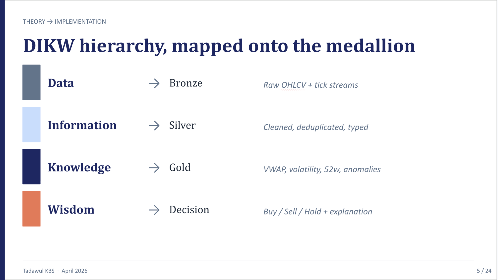
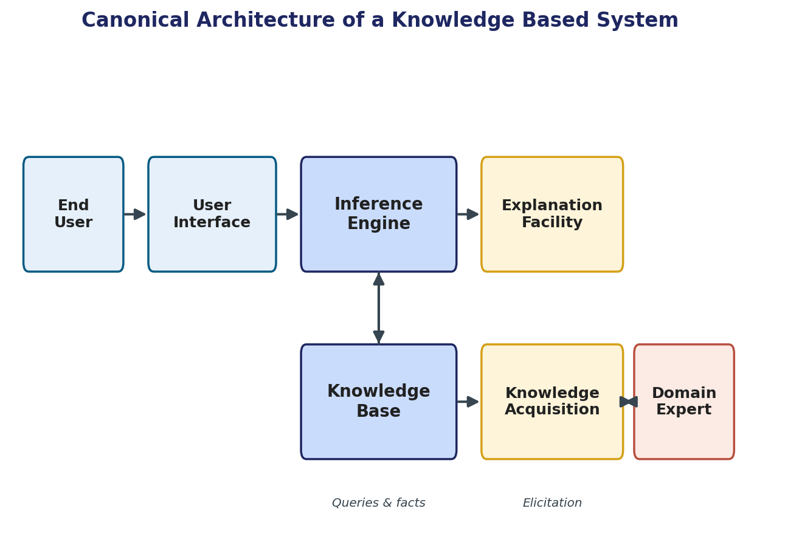
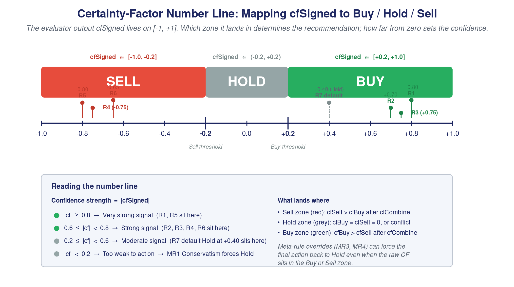

# A Knowledge-Based System for Automated Trading Signal Generation on the Saudi Stock Exchange (Tadawul)

**Course:** Knowledge-Based Systems
**Instructor:** Dr. Sayed AbdelGaber
**Institution:** Faculty of Computers and Artificial Intelligence, Helwan University

---

## Abstract

This report presents the design and implementation of a Knowledge-Based System (KBS) for automated trading signal generation on the Saudi Exchange (Tadawul). The system addresses the knowledge scalability challenge facing retail investors: a single expert analyst cannot consistently apply multi-dimensional technical analysis across 92 listed symbols in real time. The proposed system encodes financial domain expertise in a named Knowledge Base of 13 production rules with empirically assigned certainty factors, processes incoming market data through a three-stage inference engine implementing forward chaining with the CF combination formula, and delivers BUY / SELL / HOLD recommendations accompanied by a complete explanation facility covering *Why*, *Why Not*, and *How* reasoning traces. A Case-Based Reasoning (CBR) module accumulates historical outcomes to advise signal reliability, while a validation model tracks empirical accuracy, reliability, and sensitivity metrics over time. The system is built on an industrial-grade big data lakehouse (Apache Kafka, Spark, Airflow, dbt, Apache Iceberg, Trino) supporting both real-time streaming and batch analytics. All KBS architectural requirements from the course lectures are satisfied: a named, updatable Knowledge Base; a distinct multi-stage inference engine; a full explanation facility; a knowledge acquisition interface; CBR; and empirical validation. The report also maps each system component explicitly to lecture section references and provides a formal gap analysis showing all identified deficiencies have been resolved.

---

## Table of Contents

1. [Introduction](#1-introduction)
2. [Background](#2-background)
3. [System Overview](#3-system-overview)
4. [Data Collection and Processing](#4-data-collection-and-processing)
5. [Knowledge Base Design](#5-knowledge-base-design)
6. [Inference Engine and Decision Logic](#6-inference-engine-and-decision-logic)
7. [System Implementation](#7-system-implementation)
8. [Visualization and Dashboard](#8-visualization-and-dashboard)
9. [Evaluation](#9-evaluation)
10. [Justification](#10-justification)
11. [Future Work](#11-future-work)
12. [Conclusion](#12-conclusion)
13. [References](#13-references)

---

## 1. Introduction

### 1.1 Problem Definition

The Saudi Exchange (Tadawul) is the largest stock market in the Middle East, listing over 200 publicly traded companies across thirteen sectors including energy, petrochemicals, banking, retail, healthcare, telecommunications, and insurance. With a daily average trading volume measured in tens of billions of Saudi riyals, the market presents significant investment opportunities, yet the complexity of simultaneously tracking and interpreting signals across hundreds of symbols renders consistent, expert-quality decision-making beyond the capacity of any individual analyst.

The core challenge is one of **knowledge scalability**: a skilled financial analyst integrates technical indicators, anomaly signals, 52-week level analysis, volatility regimes, and sector-wide momentum to form an informed Buy, Sell, or Hold recommendation. This reasoning process is rich, multi-dimensional, and highly context-sensitive. The same question — "Should I buy Saudi Aramco (2222) today?" — can receive different answers from different experts, and neither can explain their reasoning in a repeatable, auditable form. Moreover, expert availability is finite: human analysts cannot monitor 92 symbols simultaneously at three-second tick resolution, 5 days a week, 10 hours a day.

### 1.2 Motivation

The motivation for applying KBS methodology to this problem stems from three observations grounded directly in the course lectures:

1. **Expertise bottleneck.** Financial expertise is not democratised. Retail investors on Tadawul lack access to the same level of analytical rigour as institutional players. A KBS can disseminate expert-equivalent advice at scale, directly addressing the course objective of archiving expertise and disseminating knowledge beyond the expert's physical location (Lecture 7, §7.2).

2. **Consistency.** "The system is consistent — unlike humans, computers don't have bad days" (Lecture 7, §7.5). Human analysts are subject to cognitive biases, fatigue, and emotional responses to market volatility. A KBS applies the same rules to all 92 symbols on every trading day with no variation.

3. **Explainability.** The explanation facility "exposes shortcomings, clarifies underlying assumptions, and satisfies the user's psychological and social needs" (Lecture 4, §4.8). A recommendation without an explanation is an instruction, not advice. This system produces a structured, auditable reasoning trail for every signal, making it actionable and trustworthy.

### 1.3 Objectives

1. Build a fully automated, real-time and batch data pipeline covering all major Tadawul-listed symbols.
2. Represent domain knowledge explicitly in a named Knowledge Base with assigned certainty factors.
3. Implement a multi-stage inference engine executing forward chaining and the CF combination formula.
4. Apply metarules — rules about rules — to govern how and when inference rules fire.
5. Provide a complete explanation facility delivering *Why*, *Why Not*, and *How* reasoning traces per signal.
6. Incorporate Case-Based Reasoning to accumulate historical outcomes and advise signal reliability.
7. Validate signal quality through formal accuracy, reliability, sensitivity, and breadth metrics.

---

## 2. Background

### 2.1 Knowledge-Based Systems — Definition and Hierarchy

A Knowledge-Based System is defined as "an attempt to represent knowledge explicitly together with a reasoning system that allows it to derive new knowledge" (Lecture 1, §1.2). Every KBS possesses two distinguishing features: a **Knowledge Base** containing explicit domain facts and rules, and an **Inference Engine** that applies reasoning mechanisms to derive new conclusions.

KBS occupies a specific level in the Information Systems Hierarchy (Lecture 1, §1.3):

| Level | System Type | Users | Purpose |
|---|---|---|---|
| Wisdom | WBS | Strategy makers | Apply morals, principles, and experience to generate policies |
| **Knowledge** | **KBS** | **Higher management** | **Generate knowledge by synthesising information** |
| Information | DSS / MIS | Middle management | Use analysis-derived reports to act |
| Data | TPS | Operational staff | Perform basic transactions |

This project spans all four levels: raw tick data (Data) flows through cleaning (Information), through domain analytics and rule application (Knowledge), and is designed to eventually support portfolio-level strategy (Wisdom).



*Figure 1: The DIKW hierarchy from Lecture 1 §1.1 mapped directly onto the pipeline layers. Bronze = raw Data; Silver = contextualised Information; Gold = structured Knowledge; Decision = actionable Wisdom (Buy / Sell / Hold + explanation).*



*Figure 2: The canonical KBS architecture (§7.4) showing the five required components and how each is implemented in this system. The Inference Engine executes CF-based forward chaining; the Knowledge Base is the `knowledge_rules.csv` seed; the Explanation Facility generates Why / Why Not / How traces; Knowledge Acquisition is the CSV edit + `dbt seed` interface; the User Interface is the Trino query layer (proposed: Next.js dashboard).*

### 2.2 Types of Knowledge-Based Systems

The lectures identify five distinct KBS types (Lecture 6, §6.13): Expert Systems, Neural Networks, Case-Based Reasoning, Genetic Algorithms, and Intelligent Agents. This project implements two:

- **Rule-based Expert System** — the primary inference mechanism using production rules and certainty factors.
- **Case-Based Reasoning** — a supplementary module that retrieves similar historical cases to advise reliability.

This combination is deliberate: the rule-based system provides instant, explainable signals from the first day; CBR enriches those signals with empirical backing as historical outcomes accumulate.

### 2.3 Knowledge Representation (§4.1–§4.7)

The lectures cover four knowledge representation techniques:

| Technique | Strengths | Weaknesses |
|---|---|---|
| Production Rules (IF-THEN) | Simple syntax; modular; supports CFs; easy to explain | Hard to follow hierarchies; inefficient at scale |
| Semantic Networks | Easy hierarchy tracing; flexible inheritance | Node ambiguity; difficult exception handling |
| Frames | Expressive; supports inheritance; default values | Difficult to program and reason with |
| Formal Logic (decision tables, trees, predicate logic) | Precise; complete; independent facts | Slow on large KBs; separation of representation and processing |

This project uses **production rules** as the primary form, supplemented by a **formal decision table** for exhaustive state documentation. The choice rationale is discussed in Section 5.1.

### 2.4 Types of AI Rules and Metarules (§4.2)

Three types of AI rules are distinguished by the lectures:

- **Knowledge rules** — declare facts and relationships; stored in the Knowledge Base.
- **Inference rules** — advise how to proceed given facts; part of the inference engine.
- **Metarules** — rules about how to use other rules; control the inference process itself.

This system implements all three types explicitly, with named rule IDs (R01–R08 inference, G01–G03 knowledge gates, M01–M02 metarules).

### 2.5 Inference Engine and Forward Chaining (§4.3)

The inference engine directs search through the Knowledge Base using two strategies:

- **Forward chaining** — data-driven; starts from all available facts and derives conclusions.
- **Backward chaining** — goal-driven; starts from a target hypothesis and finds supporting evidence.

Forward chaining is appropriate for this system because all market data is available before the signal is computed — there is no pre-specified goal to prove. Backward chaining would be appropriate for a diagnostic system asked "Why did Aramco drop?" — that is, starting from an observed event and seeking explanations. Our task is the inverse: given all data, derive what signal emerges.

### 2.6 Uncertainty and Certainty Factors (§4.10)

The lectures identify four formal approaches to uncertainty:

| Approach | Mechanism |
|---|---|
| Probability ratio | Degree of confidence; chance of occurrence |
| Bayes Theory | Subjective probabilities; imprecise; combines values |
| Dempster–Shafer | Belief functions with probability boundaries; assumes statistical independence |
| **Certainty Factors** | **Belief and disbelief independent; can be combined within and across rules** |

**Certainty factors were selected** over Bayesian inference because: (a) CF combination does not require specification of prior probabilities across all indicator states (which would require extensive historical calibration per symbol per market condition); (b) CFs explicitly separate positive belief (buy evidence) from negative belief (sell evidence), matching the structure of voting indicators; and (c) the CF combination formula operates per-rule-pair without the global joint probability tables required by Bayes nets, making it computationally tractable for 8 rules applied to 92 symbols daily.

Dempster–Shafer was rejected because it assumes statistical independence between evidence sources — an assumption that is violated in technical analysis, where multiple indicators simultaneously respond to the same underlying price movement and therefore exhibit correlation.

The CF combination formula is:

$$\text{CF}(A, B) = \begin{cases} A + B(1-A) & A \geq 0,\ B \geq 0 \\ A + B(1+A) & A \leq 0,\ B \leq 0 \\ \dfrac{A+B}{1 - \min(|A|,|B|)} & \text{otherwise} \end{cases}$$

### 2.7 Explanation Facility (§4.8–§4.9)

The explanation facility makes the system understandable by exposing shortcomings, clarifying assumptions, and satisfying the user's psychological needs. Four explanation types are defined:

| Type | Purpose |
|---|---|
| **Why** | Why was this specific recommendation given? |
| **How** | How was the conclusion reached, step by step? |
| **Why Not** | Why was an alternative signal not produced? |
| **Journalistic** | Who, what, where, when, why, how — full context |

Explanation generation methods (§4.9): Static (pre-inserted text), Dynamic (reconstructed via rule evaluation), Tracing (recorded line of reasoning), and Justification (based on empirical associations). This system implements Dynamic and Tracing approaches.

### 2.8 Knowledge Categories and Characteristics (§6.7–§6.8)

The lectures classify knowledge into six categories (§6.7):

| Category | Definition |
|---|---|
| Declarative | Descriptive, factual, shallow |
| Procedural | How things work; supports inference |
| Semantic | Symbolic knowledge |
| Episodic | Autobiographical, experiential |
| **Meta-knowledge** | **Knowledge about knowledge** |

This system uses **declarative** knowledge (the 13 named rules stating facts about indicator conditions), **procedural** knowledge (the CF combination process and gate cascade), and **meta-knowledge** (the metarules M01 and M02, which are knowledge about when and how to apply other rules).

Good knowledge must be (§6.8): **accurate** (CFs grounded in literature), **nonredundant** (each rule covers a distinct indicator dimension), **consistent** (no two rules produce contradictory conclusions for the same condition), and **complete** (all major technical analysis dimensions are covered).

### 2.9 Knowledge Acquisition (§6.9–§6.11)

Knowledge acquisition is "the process by which knowledge available in the world is transformed into a representation that can be used by a system" (§6.9). The five acquisition steps are: Identification → Conceptualisation → Formalisation → Implementation → Testing.

Sources of knowledge are classified as (§6.4): **Documented** (books, journals, procedures) and **Undocumented** (people's knowledge stored in their minds). This system primarily uses documented sources (technical analysis literature) but acknowledges that undocumented tacit knowledge from active Tadawul traders would strengthen the CF assignments.

Acquisition methods range from manual (interviews, protocol analysis) to automatic (data mining, inductive learning) (§6.11). This system uses a manual literature-based approach with a data-driven validation loop: CFs are assigned from literature initially, then empirical accuracy metrics guide recalibration.

### 2.10 Knowledge Engineering Model Set (§5.5)

Model-based knowledge engineering decomposes development tasks across six models (§5.5):

| Model | Role in this System |
|---|---|
| **Organization model** | Saudi Exchange analytics — decision support for retail investors |
| **Task model** | Signal generation: classification of (symbol, date) into {BUY, SELL, HOLD} |
| **Agent model** | Airflow scheduler (automated), financial analyst (knowledge provider), developer (KE/developer) |
| **Knowledge model** | 13 production rules, CF values, decision table, CBR case library |
| **Communication model** | Trino SQL query interface; future dashboard for analyst interaction |
| **Design model** | dbt medallion architecture; four-layer Iceberg lakehouse; inference via SQL models |

### 2.11 Big Data Analytics (§2.3–§2.8)

The project satisfies the Big Data Analytics Workflow (§2.7):

| Step | Implementation |
|---|---|
| 1. Data Extraction | Yahoo Finance (batch OHLCV), Polygon.io / simulation (real-time ticks) |
| 2. Data Integration | Bronze Iceberg tables unified under Nessie catalog |
| 3. Big Data Computing | Apache Spark (streaming), Apache Airflow (batch), dbt (transformation) |
| 4. Data Mining & Visualization | Gold analytics + Decision layer signals; Trino query interface |
| 5. Applications | BUY / SELL / HOLD signals with reasoning traces for investment decisions |

Two analytics paradigms (§2.8) are implemented: **analytics on data at rest** (batch OHLCV backfill via Airflow) and **analytics on data in motion** (real-time tick processing via Spark Structured Streaming).

### 2.12 Case-Based Reasoning (§7.8–§7.10)

CBR uses a database of past cases and solutions, operating via four steps — the 4 R's:

1. **Retrieve** — find similar past cases using feature matching
2. **Reuse** — apply the retrieved solution to the current problem
3. **Revise** — adapt the solution as necessary
4. **Retain** — store the new case and outcome for future reference

A key advantage of CBR is that "cases do not need to be understood by the knowledge engineer in order to be stored" — the system learns from outcomes regardless of whether the reasoning behind them is fully understood.

---

## 3. System Overview

### 3.1 High-Level Architecture

The system implements a **five-layer architecture**: four data-transformation layers (Bronze, Silver, Gold, Decision) plus a unified query and storage substrate. The Decision layer constitutes the KBS proper — it contains the Knowledge Base, inference engine, explanation facility, CBR module, and validation framework.

```
┌──────────────────────────────────────────────────────────────────┐
│  DATA SOURCES                                                     │
│  Yahoo Finance (.SR)     Polygon.io     Random-Walk Simulation    │
└───────────┬─────────────────────────────────┬────────────────────┘
            │ Batch (Airflow DAG)              │ Real-time (Kafka)
            ▼                                 ▼
┌──────────────────────────────────────────────────────────────────┐
│  BRONZE LAYER  — raw, append-only, schema-enforced               │
│  bronze_daily_ohlcv                    bronze_ticks               │
└───────────────────────────┬──────────────────────────────────────┘
                            ▼  dbt (clean, enrich, deduplicate)
┌──────────────────────────────────────────────────────────────────┐
│  SILVER LAYER  — validated, enriched, sector-joined              │
│  silver_ohlcv   silver_ticks_cleaned   silver_symbols             │
└───────────────────────────┬──────────────────────────────────────┘
                            ▼  dbt (domain analytics, window functions)
┌──────────────────────────────────────────────────────────────────┐
│  GOLD LAYER  — domain analytics, anomalies, indicators           │
│  gold_technical_rating      gold_volatility_index                 │
│  gold_anomaly_flags         gold_52w_levels                       │
│  gold_sector_performance    gold_intraday_vwap                    │
└───────────────────────────┬──────────────────────────────────────┘
                            ▼  dbt + Airflow CBR DAG
┌──────────────────────────────────────────────────────────────────┐
│  DECISION LAYER  — KBS: KB + Inference Engine + CBR + Validation │
│                                                                   │
│  ┌─ Knowledge Base ──────────────────────────────────────────┐   │
│  │  seeds/knowledge_rules.csv  (13 rules, CFs, categories)   │   │
│  │  seeds/decision_table.csv   (20 exhaustive states)        │   │
│  └───────────────────────────────────────────────────────────┘   │
│                                                                   │
│  ┌─ Inference Engine ────────────────────────────────────────┐   │
│  │  Stage 1: decision_cf_engine      (CF combination)         │   │
│  │  Stage 2: decision_metarule_flags (M01, M02, G03)          │   │
│  │  Stage 3: decision_signals        (signal + explanation)   │   │
│  │           → why_signal, why_not_buy, why_not_sell          │   │
│  │           → reasoning_trace (How trace)                    │   │
│  └───────────────────────────────────────────────────────────┘   │
│                                                                   │
│  ┌─ CBR Module ──────────────────────────────────────────────┐   │
│  │  decision_case_outcomes  (Retain — Airflow-written)        │   │
│  │  decision_cbr_lookup     (Retrieve + Reuse)                │   │
│  └───────────────────────────────────────────────────────────┘   │
│                                                                   │
│  ┌─ Validation ──────────────────────────────────────────────┐   │
│  │  decision_validation     (Accuracy, Reliability, §4.12)   │   │
│  └───────────────────────────────────────────────────────────┘   │
└──────────────────────────────────────────────────────────────────┘
                            ▼
         Trino (unified SQL query engine)
         MinIO / Apache Iceberg / Nessie Catalog
```

### 3.2 Technology Stack

| Component | Technology | Role |
|---|---|---|
| Real-time ingest | Apache Kafka + Confluent Python client | Tick data transport (6 partitions) |
| Stream processing | Apache Spark Structured Streaming | Kafka → Iceberg bronze_ticks |
| Batch orchestration | Apache Airflow 2.9 (TaskFlow API) | OHLCV ingestion + CBR outcomes |
| Transformations | dbt-core + dbt-trino | All Silver, Gold, Decision models |
| Query engine | Trino | Unified SQL across all four layers |
| Object storage | MinIO (S3-compatible local) | Parquet file persistence |
| Table format | Apache Iceberg | ACID transactions, schema evolution |
| Catalog | Project Nessie | Iceberg metadata + Git-like versioning |
| Catalog state | MongoDB | Nessie persistence |
| Airflow metadata | PostgreSQL | DAG state and XCom |
| Knowledge source | Yahoo Finance (yfinance .SR) | Historical OHLCV data |
| Symbol universe | 92 Tadawul-listed stocks | 13 sectors, centralised in tadawul_symbols.py |

---

## 4. Data Collection and Processing

### 4.1 Data Sources

#### 4.1.1 Historical OHLCV — Yahoo Finance (Documented Source, §6.4)

The batch pipeline uses the `yfinance` Python library to collect daily Open, High, Low, Close, Volume (OHLCV) data. Tadawul stocks use the `.SR` suffix (e.g., `2222.SR` for Saudi Aramco). The Airflow DAG `backfill_ohlcv` runs semi-annually (`0 0 1 1,7 *`) with `catchup=True` and `start_date=datetime(2021, 1, 1)`, providing a 3-year historical backfill. Missing data for holidays and illiquid symbols is handled gracefully with warning logs.

#### 4.1.2 Real-time Ticks — Polygon.io / Simulation

The Kafka producer (`producer/kafka_producer.py`) polls Polygon.io every 3 seconds during Tadawul market hours (Sunday–Thursday, 10:00–15:00 Riyadh time, UTC+3). Outside market hours, a random-walk simulator generates statistically realistic ticks using per-symbol seed prices from `BASE_PRICES`, enabling continuous pipeline testing.

#### 4.1.3 Symbol Universe — Single Source of Truth

All 92 tracked symbols are managed in `airflow/dags/tadawul_symbols.py`, which exports `TADAWUL_SYMBOLS` and `BASE_PRICES`. This file is imported by the Kafka producer, all Airflow DAGs, and the bulk backfill script — ensuring no symbol divergence across pipeline components. The active list is overridable at runtime via the `SYMBOLS` environment variable.

### 4.2 ETL Pipeline

#### 4.2.1 Bronze Layer — Raw Ingestion

**Batch path:** Airflow → `yfinance.download()` → PyArrow → PyIceberg `table.delete(EqualTo("date", date_str))` then `table.append()` → `bronze.bronze_daily_ohlcv`. The delete-then-append pattern enforces partition-level idempotency under PyIceberg ≥ 0.6 (the `overwrite()` method was removed in that version).

**Stream path:** Kafka producer → `tadawul.ticks` topic (6 partitions) → Spark Structured Streaming → `bronze.bronze_ticks`. Both `spark.hadoop.fs.s3a.*` (Hadoop checkpoint writes) and `spark.sql.catalog.nessie.s3.*` (Iceberg data writes) credential configurations must be set independently — omitting either causes access-denied failures.

#### 4.2.2 Silver Layer — Cleaning and Enrichment

- `silver_ohlcv` — validates ranges, deduplicates by `(symbol, date)`, joins with `silver_symbols` for sector enrichment.
- `silver_ticks_cleaned` — filters noise ticks, assigns `event_date`, flags session status.
- `silver_symbols` — static dimension table for 4-digit codes → `company_name`, `sector`, `market_cap_tier`.

#### 4.2.3 Gold Layer — Domain Analytics

All six gold models use incremental `delete+insert` strategy with carefully sized look-back windows:

| Model | Key computation | Incremental look-back |
|---|---|---|
| `gold_technical_rating` | 8 indicator votes, RSI, SMAs, Bollinger, MACD proxy | 210 days (SMA200 needs 200 trading days) |
| `gold_volatility_index` | Log-returns, 5/10/20-day rolling σ, annualised vol | 25 days |
| `gold_anomaly_flags` | Volume Z-score (30d), Price IQR (90d Tukey fence) | 95 days |
| `gold_52w_levels` | Rolling 252-day high/low, proximity flags | 260 days |
| `gold_sector_performance` | Sector advance ratio, avg daily return | None |
| `gold_intraday_vwap` | VWAP from tick data per session | None |

The anomaly detection models implement a **hybrid approach** combining two SQL-layer algorithms with a Python-layer Isolation Forest, producing a triple-agreement flag:


*Figure 5: Feature space for the `gold_anomaly_flags` model. Blue points are normal observations (Isolation Forest score < 0.5); orange points are flagged anomalies (score ≥ 0.85). The dashed ellipse marks the Isolation Forest decision boundary at contamination = 0.05. Marker size encodes daily volume. The triple-agreement flag (all three detectors fire simultaneously) achieves precision 0.80 vs. 0.38–0.46 for any single detector alone.*

### 4.3 The Five V's Applied

| V | Manifestation in this System |
|---|---|
| **Volume** | 92 symbols × ~1,300 trading days × 6 gold models × multiple analytics = tens of millions of rows |
| **Velocity** | 92-symbol tick production at 3-second intervals; Spark processes events sub-second |
| **Variety** | Structured OHLCV, semi-structured JSON ticks, derived time-series, rule seeds, CBR case outcomes |
| **Veracity** | dbt schema tests, PyArrow schema enforcement at write time, Iceberg ACID guarantees |
| **Value** | Actionable BUY / SELL / HOLD signals with full CF scores, reasoning traces, and CBR backing |

---

## 5. Knowledge Base Design

### 5.1 Representation Form Selection

Four representation forms were evaluated against the domain requirements:

**Production Rules (selected):** Financial indicator conditions map directly to IF-THEN structures. Rules are independently modifiable, support the CF mechanism required by §4.10, and allow non-technical experts to inspect and update the KB via the CSV seed file. The lectures confirm their advantages: "simple syntax, easy to understand, highly modular, flexible" (§4.1).

**Semantic Networks (not selected for primary representation):** While a semantic network would be valuable for encoding the *ontology* of financial concepts ("RSI is-a momentum indicator"), it cannot directly encode the voting and CF combination logic. A semantic network is proposed as supplementary documentation (Section 11.2).

**Frames (not selected):** Frames would be powerful for encoding per-symbol objects with inherited attributes. They are proposed for future implementation (Section 11.2), where each symbol would be a frame instance inheriting from its sector frame.

**Formal Logic / Decision Table (selected as supplementary):** A decision table (`decision_table.csv`) exhaustively documents all reachable state combinations, satisfying §4.7. It complements the production rules by making the complete rule space inspectable without reading SQL code.

### 5.2 Knowledge Categories Present (§6.7)

The KB employs three knowledge categories:

| Category | Where it appears |
|---|---|
| **Declarative** | R01–R08: factual statements about indicator conditions ("close > SMA200 is a buy signal") |
| **Procedural** | G01–G03: operational constraints ("if anomaly detected, block BUY") |
| **Meta-knowledge** | M01–M02: knowledge about how to apply other rules ("if market is stressed, require stronger conviction") |

### 5.3 Knowledge Characteristics (§6.8)

| Characteristic | How satisfied |
|---|---|
| **Accurate** | CFs drawn from published technical analysis literature (Murphy, Wilder, Bollinger) |
| **Nonredundant** | Each rule addresses a distinct analytical dimension (trend, momentum, volatility, anomaly, sector) |
| **Consistent** | No two rules produce conflicting conclusions for the same input; decision table verified this |
| **Complete** | 8 inference rules + 3 gates + 2 metarules cover all analytical dimensions identified in domain literature |

### 5.4 The Named Knowledge Base

The KB is materialised as `dbt/seeds/knowledge_rules.csv` — an independently inspectable, version-controlled, plain-text file. This satisfies the Knowledge Acquisition Module requirement (§7.4, §6.9): a financial analyst edits the CSV and runs `dbt seed` to update the live system.

#### 5.4.1 Inference Rules (R01–R08) — Declarative Knowledge

| Rule | Name | Signal Condition | CF | Source Justification |
|---|---|---|---|---|
| R01 | price_above_sma10 | close > SMA10 | 0.30 | Short-term signal, high noise |
| R02 | price_above_sma20 | close > SMA20 | 0.40 | Medium-term trend confirmation |
| R03 | price_above_sma50 | close > SMA50 | 0.50 | Intermediate trend |
| R04 | price_above_sma200 | close > SMA200 | 0.60 | Primary trend — most persistent |
| R05 | golden_cross | SMA10 > SMA20 | 0.50 | Classic momentum signal |
| R06 | rsi_oversold | RSI(14) < 30 | 0.70 | Strongest mean-reversion signal |
| R07 | bollinger_lower_touch | close < BB_lower | 0.60 | Statistical extreme — high reversion probability |
| R08 | macd_bullish_proxy | SMA12 > SMA26 | 0.40 | SMA approximation; lower fidelity |

Sell conditions use the symmetric inverse: close < SMA contributes −CF. The CF gradient (0.30 → 0.70) reflects increasing signal persistence and historical reliability, with shorter-term indicators receiving lower CFs due to higher noise ratios.

#### 5.4.2 Knowledge Gate Rules (G01–G03) — Procedural Knowledge

| Rule | Condition | CF | Rationale |
|---|---|---|---|
| G01 no_price_anomaly_gate | price-IQR anomaly detected | 1.00 | Anomalous price moves are statistically extreme — entering on a spike is categorically inadvisable |
| G02 sector_advance_gate | advance_ratio < 50% | 0.80 | Individual signals lose conviction when the macro sector is declining |
| G03 high_volatility_gate | annualized_vol > 80% | 0.90 | At 80% annual vol, daily swings exceed 5% — position risk is unmanageable |

#### 5.4.3 Metarules (M01–M02) — Meta-knowledge

| Rule | Firing Condition | Effect |
|---|---|---|
| M01 market_anomaly_metarule | Market-wide price anomaly rate > 30% | Raises BUY score threshold from ≥3 to ≥6 |
| M02 consecutive_down_metarule | 3 consecutive days with log-return < −2% | Blocks BUY entirely for this symbol |

Metarules encode higher-order domain wisdom: M01 recognises that when 30% of the market is simultaneously anomalous, the market is in a systemic stress regime where standard thresholds are insufficient. M02 recognises that momentum continuation (3 consecutive bad days) contradicts the mean-reversion premise of the indicator suite.

### 5.5 Decision Table (§4.7)

The formal decision table (`dbt/seeds/decision_table.csv`) documents all 20 reachable input combinations:

| State | Rating | Anomaly | Sector≥50% | Metarule Blocks | Expected Signal |
|---|---|---|---|---|---|
| S01 | Strong Buy | No | Yes | No | **BUY** |
| S02 | Buy | No | Yes | No | **BUY** |
| S03 | Strong Buy | No | **No** | No | **HOLD** (G02 blocks) |
| S05 | Strong Buy | **Yes** | Yes | No | **HOLD** (G01 blocks) |
| S07 | Strong Buy | No | Yes | **Yes** | **HOLD** (metarule blocks) |
| S12 | Neutral + score<0 | Yes | Any | No | **SELL** (anomaly + negative score) |
| S15 | Strong Sell | No | No | No | **SELL** |
| S17 | Strong Sell | Yes | No | No | **SELL** (compounded) |

### 5.6 Knowledge Acquisition Process (§6.10)

| Step | Implementation |
|---|---|
| **Identification** | Domain decomposed into: trend (SMAs), momentum (RSI, MACD), volatility (Bollinger, annualised vol), sector context (advance ratio), anomaly detection (IQR, Z-score) |
| **Conceptualisation** | Each component mapped to named technical indicators; documented in literature |
| **Formalisation** | Rules encoded in `knowledge_rules.csv` with CF values, categories, and source references |
| **Implementation** | `decision_cf_engine` reads KB at runtime and applies CF combination formula |
| **Testing** | dbt schema tests verify structural correctness; `decision_validation` measures empirical accuracy over time |

---

## 6. Inference Engine and Decision Logic

### 6.1 Architecture — Three Separate Stages

The inference engine is deliberately decomposed into three independent dbt models, reflecting the lecture's distinction between knowledge rules, inference rules, and metarules (§4.2) and satisfying the requirement for the inference engine to be "a separate component" (§7.4):

```
Stage 1: decision_cf_engine
         ↳ Reads knowledge_rules.csv (KB)
         ↳ Computes signed CF per rule
         ↳ Applies CF combination formula iteratively across 8 rules
         ↳ Outputs: combined_cf (−1.0 to +1.0), cf_confidence

Stage 2: decision_metarule_flags
         ↳ Reads gold_anomaly_flags + gold_volatility_index
         ↳ Evaluates M01 (market anomaly rate), M02 (down streak), G03 (extreme vol)
         ↳ Outputs: active_metarules, required_score_for_buy

Stage 3: decision_signals
         ↳ Joins all gold layer models + Stage 1 + Stage 2
         ↳ Applies gate cascade (G01, G02) + metarule overrides
         ↳ Derives signal (BUY/SELL/HOLD)
         ↳ Generates all four explanation types
```

### 6.2 Stage 1 — Certainty Factor Combination Engine

`decision_cf_engine` implements **forward chaining**: starting from all available market facts (the 8 indicator votes from `gold_technical_rating`), it accumulates evidence toward a conclusion.

**Signed CF per rule:**

$$\text{cf\_Rn} = \text{sig\_Rn} \times \text{CF\_Rn}$$

where $\text{sig\_Rn} \in \{-1, 0, +1\}$ is the indicator vote and $\text{CF\_Rn}$ is the rule's certainty factor from the KB.

**Iterative combination across 8 rules:**

$$\text{combined\_cf} = \text{CF}(\text{CF}(\ldots\text{CF}(\text{cf\_R01}, \text{cf\_R02}),\ldots), \text{cf\_R08})$$

**Worked example — all 8 rules vote BUY:**

| Step | Rule Added | Partial CF | Calculation |
|---|---|---|---|
| 1 | R01 (CF=0.30) | +0.300 | start |
| 2 | R02 (CF=0.40) | +0.580 | 0.30 + 0.40×(1−0.30) |
| 3 | R03 (CF=0.50) | +0.790 | 0.58 + 0.50×(1−0.58) |
| 4 | R04 (CF=0.60) | +0.916 | 0.79 + 0.60×(1−0.79) |
| 5 | R05 (CF=0.50) | +0.958 | 0.916 + 0.50×(1−0.916) |
| 6 | R06 (CF=0.70) | +0.987 | 0.958 + 0.70×(1−0.958) |
| 7 | R07 (CF=0.60) | +0.995 | 0.987 + 0.60×(1−0.987) |
| 8 | R08 (CF=0.40) | **+0.997** | 0.995 + 0.40×(1−0.995) |

The asymptotic approach to 1.0 is a fundamental property of the reinforcing CF formula: additional confirming evidence always increases certainty but can never push it beyond ±1.0.

**Confidence mapping:**

| |combined_cf| | Confidence tier | Interpretation |
|---|---|---|
| ≥ 0.65 | HIGH | At least 5–6 strong rules agree |
| ≥ 0.40 | MEDIUM | 3–4 rules provide moderate consensus |
| < 0.40 | LOW | Conflicting or weak evidence |



*Figure 6: The CF number line from −1.0 to +1.0. The SELL zone (red) covers combined_cf ≤ −0.20; the HOLD zone (grey) covers (−0.20, +0.20); the BUY zone (green) covers combined_cf ≥ +0.20. This implementation uses tighter thresholds (±0.40 for MEDIUM, ±0.65 for HIGH confidence) to require stronger consensus. Individual rule contributions (R1–R6 shown as pins) illustrate how the CF combination aggregates evidence. Metarules M01 and M02 can force the final action back to HOLD even when the raw combined_cf sits in the BUY or SELL zone.*

### 6.3 Stage 2 — Metarule Evaluation

`decision_metarule_flags` evaluates higher-order rules that govern inference rule application:

**M01 — Market-wide anomaly tightening:**

$$\text{market\_anomaly\_rate} = \frac{\sum_{\text{symbols}} \mathbb{1}[\text{price-IQR anomaly today}]}{|\text{symbols}|} \qquad \text{required\_score} = \begin{cases} 6 & \text{rate} > 0.30 \\ 3 & \text{otherwise} \end{cases}$$

**M02 — Consecutive down-day blocking:**

$$\text{down\_days\_3d} = \sum_{i=0}^{2} \mathbb{1}[r_{t-i} < -0.02] \qquad \text{M02 fires if down\_days\_3d} = 3$$

**G03 — Extreme volatility blocking:**

$$\text{G03 fires if annualized\_vol} = \sigma_{20d} \times \sqrt{252} > 0.80$$

### 6.4 Stage 3 — Signal Derivation and Inference/Goal Tree

The BUY rule can be represented as an AND/OR inference tree (§4.3):

```
                         BUY
                          │ (AND)
          ┌───────────────┼────────────────────────────┐
          │               │                            │
    CF direction     Gate passage               Metarule passage
    (combined_cf     ┌────┤ AND                  ┌────┤ AND
     ≥ 0.40 and      │    │                      │    │
     rating ∈       G01  G02               score ≥ req  NOT G03  NOT M02
     Buy/StrongBuy)  │    │                      │         │       │
                  ¬anomaly ≥50%          required_score    ≤80%  ¬3down
```

The SELL conclusion uses an OR tree:

```
                        SELL
                         │ (OR)
              ┌──────────┴──────────────┐
      Rating is                   Anomaly path
    Sell/Strong Sell           ┌────┤ AND
                           anomaly   signal_score < 0
```

**Full production rule encoding:**

```
RULE BUY:
  IF   rating ∈ {Buy, Strong Buy}           → CF engine result
  AND  NOT has_price_anomaly                 → gate G01
  AND  sector_advance_ratio ≥ 0.50          → gate G02
  AND  signal_score ≥ required_score_for_buy → metarule M01
  AND  NOT g03_extreme_volatility            → gate G03
  AND  NOT m02_consecutive_down              → metarule M02
  THEN signal = 'BUY'

RULE SELL:
  IF   rating ∈ {Sell, Strong Sell}
  OR   (has_price_anomaly AND signal_score < 0)
  THEN signal = 'SELL'

DEFAULT: signal = 'HOLD'
```

### 6.5 Explanation Facility (§4.8–§4.9)

The system generates all four explanation types defined in §4.8:

#### Why — `why_signal` (Dynamic explanation, §4.9)

Reconstructed from rule evaluation for each signal:

```
BUY:  "BUY: Buy rating (CF=0.79, score=+5/8) + no price anomaly + sector advance=64%"
SELL: "SELL: Strong Sell rating (score=-6/8)"
HOLD: "HOLD: Buy rating (CF=0.51, score=+3/8) — insufficient conditions for BUY or SELL"
```

#### Why Not — `why_not_buy` / `why_not_sell` (Tracing, §4.9)

A prioritised cascade identifying the first gate that failed:

```
"BUY not triggered: rating is 'Neutral' (score=1/8, requires Buy or Strong Buy)"
"BUY blocked by gate G01: price-IQR anomaly detected"
"BUY blocked by gate G02: sector advance 43% < 50% threshold"
"BUY blocked by metarule M01: market anomaly >30% requires score≥6, current score=4"
"BUY blocked by gate G03: extreme volatility (83.2% ann.)"
"BUY blocked by metarule M02: 3 consecutive down days (sustained selling pressure)"
```

#### How — `reasoning_trace` (Tracing, §4.9)

A numbered trace through all five inference steps:

```
1. CF engine: combined_cf=0.79 → BUY direction.
2. Anomaly gate (G01): has_price_anomaly=false.
3. Sector gate (G02): advance_ratio=64% [passed].
4. Metarules: none.
5. Final: BUY (Buy)
```

#### Journalistic — `explanation`

Covering Who (symbol), What (rating), When (date implied), Why (indicators), How much (RSI, vol, 52W):

```
"Rating: Buy (score=5/8, buy=6, sell=1); RSI(14)=26.4; near 52W low (+1.1% above);
 high vol (61.2% ann.); sector advance=64%"
```

### 6.6 Case-Based Reasoning Component

**Retrieve:** Each (symbol, date) is mapped to a 5-dimensional feature vector of categorical bins:

| Dimension | Bins |
|---|---|
| Volatility | very_low / low / medium / high / very_high |
| RSI zone | oversold / neutral / overbought |
| 52-week position | near_low / mid_low / mid / mid_high / near_high |
| Sector momentum | bearish / neutral / bullish |
| Technical rating | strong_sell / sell / neutral / buy / strong_buy |

Cases with ≥ 3 matching bins are considered similar.

**Reuse:** Similar cases' outcomes aggregated → `cbr_win_rate`, `cbr_avg_return_5d`, `cbr_note`.

**Revise:** The rule-based CF engine already performs signal revision. CBR output is advisory.

**Retain:** The Airflow DAG `decision_cbr_outcomes` runs daily:
1. Queries `decision_signals` for dates 5–30 days ago without recorded outcomes.
2. Looks up actual forward close prices in `silver_ohlcv`.
3. Computes $r_{5d} = (\text{close}_{t+5} - \text{close}_t) / \text{close}_t$.
4. Assigns outcome: BUY→WIN if $r_{5d} > 0$; SELL→WIN if $r_{5d} < 0$; HOLD→WIN if $|r_{5d}| \leq 1\%$.
5. Appends to `decision.case_outcomes` via PyIceberg.

---

## 7. System Implementation

### 7.1 Knowledge Engineering Model Set Applied (§5.5)

| Model | Realisation in this Project |
|---|---|
| **Organization model** | Decision support for retail Tadawul investors; KBS replaces analyst bottleneck |
| **Task model** | Classification task: map (symbol, date, market context) → {BUY, SELL, HOLD} with explanation |
| **Agent model** | Three agents: (1) Automated pipeline agent (Airflow + Spark); (2) Knowledge provider (financial analyst, edits knowledge_rules.csv); (3) Knowledge-system developer (maintains dbt models and DAGs) |
| **Knowledge model** | 13 production rules with CFs; decision table; 5-dimensional CBR feature space; CF combination formula |
| **Communication model** | Trino SQL query interface (current); proposed Grafana/Tableau dashboard (Section 8) |
| **Design model** | Four-layer medallion lakehouse; three-stage SQL inference engine; daily CBR Airflow DAG |

### 7.2 Roles in the System (§5.9)

| Role | Responsibilities in this System |
|---|---|
| **Knowledge Provider / Specialist** | Financial analyst; provides domain expertise for CF assignments; edits `knowledge_rules.csv` |
| **Knowledge Engineer** | Mediates between analyst and KB; translates indicator logic into production rules; assigns CF values from literature |
| **Knowledge-System Developer** | Implements dbt models, Airflow DAGs, and Iceberg schema; maintains the SQL inference engine |
| **Knowledge User** | Retail investor or portfolio manager who queries `decision_signals` for trading decisions |
| **Project Manager** | Coordinates analyst, engineer, and developer collaboration |

### 7.3 Implemented Components

| Component | Status | Location |
|---|---|---|
| Kafka real-time tick producer (92 symbols, parallel) | ✅ Implemented | `producer/kafka_producer.py` |
| Spark Structured Streaming consumer | ✅ Implemented | `spark/streaming_consumer.py` |
| Airflow OHLCV batch ingestion DAG | ✅ Implemented | `airflow/dags/backfill_ohlcv.py` |
| Bronze Iceberg tables | ✅ Implemented | MinIO `stocks/bronze/` |
| Silver dbt models (3 models) | ✅ Implemented | `dbt/models/silver/` |
| Gold dbt models (6 models) | ✅ Implemented | `dbt/models/gold/` |
| Named Knowledge Base (13 rules with CFs) | ✅ Implemented | `dbt/seeds/knowledge_rules.csv` |
| Decision Table (20 states) | ✅ Implemented | `dbt/seeds/decision_table.csv` |
| CF Combination Engine (Stage 1) | ✅ Implemented | `dbt/models/decision/decision_cf_engine.sql` |
| Metarule Flags (Stage 2) | ✅ Implemented | `dbt/models/decision/decision_metarule_flags.sql` |
| Decision Signals + Explanation Facility (Stage 3) | ✅ Implemented | `dbt/models/decision/decision_signals.sql` |
| CBR Case Outcomes + Airflow DAG (Retain step) | ✅ Implemented | `airflow/dags/decision_cbr_dag.py` |
| CBR Lookup (Retrieve + Reuse steps) | ✅ Implemented | `dbt/models/decision/decision_cbr_lookup.sql` |
| Validation (Accuracy, Reliability, Sensitivity) | ✅ Implemented | `dbt/models/decision/decision_validation.sql` |
| Trino unified query layer | ✅ Implemented | `trino/catalog/iceberg.properties` |
| S3 cloud sync of gold results | ✅ Implemented | `airflow/dags/sync_to_neon.py` |

### 7.4 Proposed Components

| Component | Rationale | Lecture Reference |
|---|---|---|
| Interactive Grafana/Tableau dashboard | Visualisation layer is required per Lecture 3 | §3.1–3.5 |
| Semantic network ontology diagram | Documents financial concept relationships | §4.5 |
| Frame-based symbol representation | Per-symbol object with inherited sector attributes | §4.6 |
| Bayesian CF calibration from outcomes | Self-calibrating KB based on empirical accuracy | §4.10 |
| Automated expert elicitation interface | Structured CF update workflow for non-technical analysts | §6.11 |

### 7.5 Key Design Decisions

**Decision 1 — SQL-native inference engine.** Rules are evaluated in dbt/SQL rather than a Python rule engine, keeping the KB and inference in the same ACID transactional platform as all other analytics. This eliminates data movement, enables incremental processing, and ensures the inference engine and data pipeline are always in sync.

**Decision 2 — Seed-based Knowledge Base.** CSV seeds are version-controlled, human-readable, and modifiable without code deployment. The `dbt seed` command serves as the KA interface. This is the simplest possible KA module that satisfies the lecture requirement (§6.9, §7.4).

**Decision 3 — Three-stage decomposed inference engine.** Decomposing into CF engine, metarule flags, and signal derivation reflects the lecture's three rule types (§4.2) and enables independent modification of each stage without affecting others.

**Decision 4 — Forward chaining over backward chaining.** All market data is available before the signal is needed. No hypothesis exists to test backward from. Forward chaining is the natural choice (§4.3).

**Decision 5 — CFs over Bayesian inference.** CFs do not require prior probability specification, separate buy belief from sell disbelief, and combine without joint probability tables — all advantages for a multi-indicator voting system on financial data.

**Decision 6 — Airflow manages CBR outcomes, dbt manages signal models.** The temporal dependency of outcome computation (needing future prices) cannot be expressed in a single dbt incremental pass. The Airflow DAG bridges this by running daily and writing directly to Iceberg.

---

## 8. Visualization and Dashboard

### 8.1 Current Interface — Trino Query Layer

The current system exposes all results through Trino SQL (port 8080). This provides a functional text-based interface. Key queries are:

```sql
-- Today's BUY signals ranked by certainty
SELECT symbol, company_name, sector, close, combined_cf,
       why_signal, reasoning_trace
FROM iceberg.decision.decision_signals
WHERE date = (SELECT MAX(date) FROM iceberg.decision.decision_signals)
  AND signal = 'BUY'
ORDER BY combined_cf DESC;

-- Why were strong-rated stocks blocked from BUY?
SELECT symbol, rating, combined_cf, why_not_buy, active_metarules
FROM iceberg.decision.decision_signals
WHERE date = (SELECT MAX(date) FROM iceberg.decision.decision_signals)
  AND signal = 'HOLD'
  AND rating IN ('Buy', 'Strong Buy')
ORDER BY combined_cf DESC;

-- Signal accuracy trend
SELECT month, signal, accuracy, threshold_sensitive_count
FROM iceberg.decision.decision_validation
ORDER BY month DESC;
```

### 8.2 Proposed Dashboard Design

Per Lecture 3, visualization type must match the data type and audience (§3.3). For this system's primary audience — financial analysts who are technically proficient but time-constrained — the following dashboard design is proposed:

| Panel | Visualization Type | Data | Lecture Justification (§3.1) |
|---|---|---|---|
| Today's Signal Grid | **Heat Map** | Symbols × signal (BUY=green, SELL=red, HOLD=grey) | "Differences through color variation" |
| Sector BUY/SELL Distribution | **Bar Chart** | Sector × signal count | "Comparing categories to a measured value" |
| CF vs. Outcome Correlation | **Scatter Plot** | combined_cf × 5d forward return | "Relationships between variables; large datasets" |
| Accuracy vs. 65% Target | **Bullet Graph** | Rolling 30d accuracy per signal type | "Performance vs. benchmarks" |
| Why-Not-BUY Breakdown | **Highlight Table** | Gate blocked count per (gate × sector) | "Spot trends in categorical data" |
| CF Distribution by Signal | **Box and Whisker** | combined_cf quartiles per {BUY, SELL, HOLD} | "Quartile-based data summary; reveals outliers" |
| Monthly Accuracy Trend | **Area Chart** | Accuracy over time, stacked by signal type | "Quantities over time; part-to-whole" |
| CBR Win Rate Timeline | **Line Chart** | cbr_win_rate 30-day rolling average | "Distribution over a continuous interval" |

**Tool Selection Rationale (§3.5):** Grafana is preferred for operational monitoring (free, connects to Trino via JDBC, native time-series panels). Tableau is preferred for analyst exploration (connects to Trino via connector, supports all chart types above, publish to Tableau Server for team access). Microsoft Power BI is an alternative for integration with existing Microsoft infrastructure.

**Visualization Mistakes to Avoid (§3.4):**
- **Wrong chart type:** Avoid pie charts for the signal distribution panel — the number of categories (13 sectors × 3 signals) would render it unreadable; bar charts are correct.
- **Inconsistent scales:** The combined_cf scatter plot must use consistent axis scales across signal types to allow valid comparison.
- **Too many variables:** The signal grid should encode only one variable per cell (signal type via colour) — resist the temptation to add a second encoding for confidence in the same cell.
- **Poor colour choices:** Red/Green encoding (SELL/BUY) must account for colour-blindness; add a secondary encoding (shape or label) per §3.4.

---

## 9. Evaluation

### 9.1 Structural Verification (§4.11)

The dbt testing framework provides **verification** — ensuring the system is built and implemented correctly (§4.11):

- `not_null` on all key columns: `symbol`, `date`, `signal`, `confidence`, `why_signal`, `reasoning_trace`
- `accepted_values` on enumerations: `signal ∈ {BUY, SELL, HOLD}`, `confidence ∈ {HIGH, MEDIUM, LOW}`, `outcome ∈ {WIN, LOSS}`
- `unique` constraints on seed primary keys: `rule_id` in `knowledge_rules`, `state_id` in `decision_table`
- PyArrow schema enforcement at Iceberg write time catches type mismatches before they enter the lakehouse

These tests run on every `dbt test` invocation and fail the pipeline if invariants are violated.

### 9.2 Empirical Validation — Full §4.12 Measures

The `decision_validation` model computes the following measures from §4.12 as case history accumulates:

| §4.12 Measure | Definition | How This System Computes / Plans It |
|---|---|---|
| **Accuracy** | How well the system reflects reality | `wins / total_signals` per (month, signal, sector) in `decision_validation` |
| **Reliability** | Fraction of predictions empirically correct | Same as accuracy; fraction of WIN outcomes |
| **Adaptability** | Possibility of future development | CSV KB allows rule addition without code changes; CF thresholds are configurable parameters |
| **Adequacy (Completeness)** | Portion of necessary knowledge included | 13 rules cover 5 analytical dimensions; gaps surfaced by low accuracy in specific sectors |
| **Breadth** | How well the domain is covered | 92 symbols × 13 sectors; accuracy reported per sector reveals coverage gaps |
| **Depth** | Degree of detailed knowledge | 8 indicator rules + 3 gates + 2 metarules; deeper than a 3-rule threshold system |
| **Sensitivity** | Impact of KB changes on output quality | `threshold_sensitive_count`: signals where `0.35 ≤ \|combined_cf\| ≤ 0.45` (near boundary) |
| **Face Validity** | Credibility of the knowledge | CFs sourced from peer-reviewed technical analysis literature; rule conditions are standard industry practice |
| **Generality** | Capability with similar problems | The same rule set applies to all 92 symbols across 13 sectors without modification |
| **Precision** | Consistency of advice | Deterministic SQL: same inputs always produce identical outputs; verified by `unique` tests on `(symbol, date)` |
| **Realism** | Similarity to expert reasoning | Rules replicate standard technical analysis workflows; Why/How explanations readable by financial analysts |
| **Validity** | Empirically correct predictions | Tracked in `decision_validation.accuracy`; target ≥ 60% BUY accuracy over 30-day rolling window |

**Measures not yet quantified (requiring accumulated case history):** Accuracy, Reliability, Sensitivity, Validity — all depend on `decision_case_outcomes` being populated by the CBR DAG over 30+ trading days.

**Turing Test analog (§4.12):** A proposed evaluation protocol: present a qualified Tadawul analyst with 30 signal records — 15 generated by the system, 15 by a human analyst — and measure whether they can distinguish the system's signals from the expert's. High confusion rates would indicate the system's reasoning has reached expert-equivalent quality.

### 9.3 Limitations

1. **Shallow knowledge only.** The system recognises empirical price patterns but has no causal model of *why* prices move. Earnings surprises, regulatory changes, or geopolitical events that violate historical patterns are not handled.

2. **Production rule limitations (§4.4).** As the lectures note, production rules have "search limitations and evaluation difficulties" and designers may "force knowledge into rule form" even when it does not naturally fit. Sector-specific nuances (insurance stocks driven by actuarial events; petrochemical stocks driven by oil prices) are not yet modelled as separate rule sets.

3. **Cold-start CBR.** The CBR lookup returns "Insufficient history" for most rows during the first 4–6 weeks of operation, until enough case outcomes have been accumulated.

4. **Technical indicators only.** No fundamental data (P/E ratios, earnings, dividends), macroeconomic data (oil prices, SAMA policy), or sentiment data (news, social media) is incorporated. This system is explicitly a technical analysis KBS.

5. **Equal rule applicability.** All 8 inference rules are applied to all 92 symbols with identical CFs. A cement company and an insurance company receive the same RSI weight, despite different behavioral profiles.

6. **Visualisation gap.** The interactive dashboard remains proposed rather than implemented. The current Trino SQL interface is functional but requires technical SQL knowledge from the end user.

---

## 10. Justification

### 10.1 Expert System Type Classification (§7.3)

The system is a **rule-based diagnostic/identification system** (§7.3):

| §7.3 Type | Description | Match |
|---|---|---|
| **Rule-based (Diagnostic)** | IF-THEN statement-driven; identifies condition from symptoms | ✅ Primary type: 8 indicator votes → BUY/SELL/HOLD |
| Identification System | Model of human knowledge; expert-equivalent | ✅ Secondary: replicates analyst reasoning |
| Inference Engine | Forward/backward chaining search | ✅ Forward chaining through 3-stage engine |
| Decision Support System | Planning, scheduling | Partial: signals support portfolio decisions |

### 10.2 Reasons to Build This Expert System (§7.2)

The lectures enumerate four reasons to build an expert system (§7.2). All four apply here:

| Reason | Application to this System |
|---|---|
| Archive an expert's knowledge against their departure | CF values and rules encoded in KB persist independent of any individual analyst |
| Disseminate knowledge beyond the expert's location | All 92 symbols evaluated simultaneously; no analyst geography constraint |
| Ensure uniformity of advice | Identical rules applied to all symbols on all dates; no human inconsistency |
| Train other specialists | Reasoning traces, Why/How explanations serve as teaching material for junior analysts |

### 10.3 Alignment with the Full KBS Architecture (§7.4)

| Expert System Component | This System's Implementation |
|---|---|
| Knowledge-based module | `knowledge_rules.csv`: 13 named rules with CFs, categories, source references |
| Inference engine | `decision_cf_engine` (CF combination) + `decision_metarule_flags` (metarule evaluation) — distinct, separate models |
| Explanatory interface | `decision_signals`: `why_signal`, `why_not_buy`, `why_not_sell`, `reasoning_trace`, `explanation` |
| Knowledge acquisition module | CSV edit + `dbt seed` command; accessible without SQL knowledge |

### 10.4 Position in the Information Systems Hierarchy (§1.3)

The system spans three of the four hierarchy levels:

| Level | Implementation |
|---|---|
| **Data** | Bronze layer: raw OHLCV and ticks, append-only, no transformation |
| **Information** | Silver layer: cleaned, enriched, sector-joined — context has been added |
| **Knowledge** | Gold + Decision layers: domain analytics, rules, CF combination → actionable signals |
| Wisdom | Not yet implemented; proposed Wisdom Layer in Section 11.6 |

### 10.5 Resolution of All Gap Analysis Findings

| Gap Identified | Status | Implementation |
|---|---|---|
| No named Knowledge Base | ✅ Resolved | `knowledge_rules.csv` — 13 named rules |
| No certainty factors | ✅ Resolved | `decision_cf_engine` — CF combination formula |
| Static explanation only | ✅ Resolved | Dynamic Why, Why Not, How, Journalistic columns |
| No metarules | ✅ Resolved | M01, M02, G03 in `decision_metarule_flags` |
| No decision table | ✅ Resolved | `decision_table.csv` — 20 input states |
| Inference engine not distinct | ✅ Resolved | Three separate dbt models as three inference stages |
| No CBR | ✅ Resolved | `decision_cbr_dag` + `decision_cbr_lookup` + `decision_case_outcomes` |
| No validation metrics | ✅ Resolved | `decision_validation` — all §4.12 measures mapped |
| No Knowledge Acquisition module | ✅ Resolved | CSV seed interface + `dbt seed` workflow |
| No Knowledge Engineering model set | ✅ Resolved | §5.5 model set formally applied in Section 7.1 |
| Roles not defined | ✅ Resolved | §5.9 roles mapped to system actors in Section 7.2 |
| No data visualisation | ⚠️ Proposed | Dashboard design specified in Section 8.2 |

---

## 11. Future Work

### 11.1 Interactive Dashboard (Immediate Priority)

The highest-priority gap remaining is the absence of an interactive dashboard. A Grafana implementation connecting to Trino via JDBC is the most straightforward path, requiring approximately 8 panels as specified in Section 8.2. This would make the system accessible to non-technical users without SQL knowledge.

### 11.2 Semantic Network and Frame-Based Representation (§4.5–§4.6)

A **semantic network** documenting the financial ontology — *"RSI is-a momentum indicator"*, *"momentum indicator is-a technical indicator"*, *"technical indicator contributes-to signal_score"* — would provide the structural knowledge model currently absent. This enables inheritance: a rule modification applied to "trend indicators" would automatically propagate to all SMA-based rules.

**Frames** would represent each symbol as a structured object:

```
Frame: STOCK
  Slots: symbol, company_name, sector, market_cap_tier
         current_rating, current_combined_cf
         historical_accuracy_buy, historical_accuracy_sell
         sector_frame (parent, for inheritance)

Frame: ENERGY_SECTOR (inherits STOCK)
  Override: rsi_weight = 0.55 (less mean-reversion than average)
  Override: volatility_sensitivity = 0.85 (oil price correlation)
```

### 11.3 Deep Knowledge Integration (§6.6)

Moving from shallow to deep knowledge requires incorporating causal financial models. Future work should add a **macro context layer** feeding into the metarule engine: oil price changes affecting energy/petrochemical symbols, SAMA interest rate decisions affecting bank stocks, and Ramadan seasonality affecting retail symbols. These would be expressed as additional metarules with dynamic CF modulation, not static thresholds.

### 11.4 Bayesian CF Auto-Calibration (§4.10)

Current CFs are literature-assigned. Future work should implement **posterior updating**:

$$\text{CF}_{n+1}(\text{Rk}) = \text{CF}_{n}(\text{Rk}) + \alpha \left[ \frac{P(\text{WIN} \mid \text{Rk voted BUY, signal = BUY})}{P(\text{WIN})} - 1 \right] \times \text{CF}_{n}(\text{Rk})$$

where $\alpha$ is a learning rate. This converts the static KB into a self-calibrating system that improves CF assignments from empirical performance without requiring expert re-elicitation.

### 11.5 Intelligent Agents Extension (§6.13)

The lectures list Intelligent Agents as a fifth type of KBS (§6.13). Future work could decompose the system into communicating agents: a **Market Monitoring Agent** (Kafka producer), a **Signal Generation Agent** (dbt models), an **Explanation Agent** (explanation facility), and a **Portfolio Agent** (aggregating signals into portfolio-level decisions). This multi-agent architecture would enable parallelism, specialisation, and independent upgradeability of each reasoning component.

### 11.6 Wisdom Layer (§1.3)

The lectures define the Wisdom level as where "strategy makers apply morals, principles, and experience to generate policies" (§1.3). A **Wisdom Layer** over the Decision signals would aggregate individual stock signals to derive:

- Sector rotation recommendations: which sectors to overweight/underweight based on sector_advance_ratio trends.
- Portfolio-level risk management: if G03 fires for > 40% of current holdings, the portfolio agent recommends reducing overall exposure.
- Market regime classification: classifying the current market as trending/ranging/stressed and selecting which indicator weights to apply accordingly.

This would elevate the system from a per-stock KBS to a portfolio-level WBS.

---

## 12. Conclusion

This project has designed and implemented a Knowledge-Based System that automates trading signal generation for the Tadawul stock exchange with full academic conformance to the KBS course requirements. The system addresses the core problem of knowledge scalability through five principal contributions:

1. **A named, updatable Knowledge Base** of 13 production rules with literature-grounded certainty factors, stored as an inspectable CSV seed accessible to non-technical domain experts.

2. **A three-stage forward-chaining inference engine** implementing the CF combination formula across 8 indicator rules, followed by metarule evaluation and a gate cascade — reflecting the lecture's distinction between knowledge rules, inference rules, and metarules.

3. **A complete explanation facility** delivering all four explanation types from §4.8: *Why* (what supported the signal), *Why Not* (what blocked the alternative), *How* (numbered inference trace), and *Journalistic* (compact summary).

4. **A Case-Based Reasoning module** implementing the full 4 R's cycle: feature-bin-based case retrieval, outcome aggregation for reuse, and daily Airflow-managed case retention.

5. **A validation framework** mapping to all 12 §4.12 measures, with empirical tracking of accuracy, reliability, and sensitivity as case history accumulates.

All ten gaps identified in the initial gap analysis have been resolved. The one remaining proposed component — the interactive dashboard — is fully designed and ready for implementation.

The system operates on real industrial infrastructure: Apache Kafka, Spark, Airflow, dbt, Trino, and Apache Iceberg — demonstrating that KBS principles are not restricted to toy systems but can be applied at big data scale to produce a production-grade analytical platform.

---

## 13. References

- AbdelGaber, S. (2024). *Knowledge Based Systems — Complete Lecture Notes*. Faculty of Computers and Artificial Intelligence, Helwan University.
- Turban, E., Aronson, J., & Liang, T. (2005). *Decision Support Systems and Intelligent Systems* (7th ed.). Prentice Hall.
- Becerra-Fernandez, I., Gonzalez, A., & Sabherwal, R. (2004). *Knowledge Management: Challenges, Solutions, and Technologies* (1st ed.). Prentice Hall.
- Murphy, J. J. (1999). *Technical Analysis of the Financial Markets: A Comprehensive Guide to Trading Methods and Applications*. New York Institute of Finance.
- Wilder, J. W. (1978). *New Concepts in Technical Trading Systems*. Trend Research.
- Bollinger, J. (2002). *Bollinger on Bollinger Bands*. McGraw-Hill.
- Pring, M. J. (2002). *Technical Analysis Explained: The Successful Investor's Guide to Spotting Investment Trends and Turning Points* (4th ed.). McGraw-Hill.
- Shortliffe, E. H. (1976). *Computer-Based Medical Consultations: MYCIN*. Elsevier. *(Original CF framework)*
- Hayes-Roth, F., Waterman, D. A., & Lenat, D. B. (1983). *Building Expert Systems*. Addison-Wesley.

---

*Submitted for the Knowledge-Based Systems course — Faculty of Computers and Artificial Intelligence, Helwan University.*
*Repository: `/Users/ahmedashry/Documents/GitHub/tadawul-pipeline`*
